# BFFs | Brazilian Finger Foods

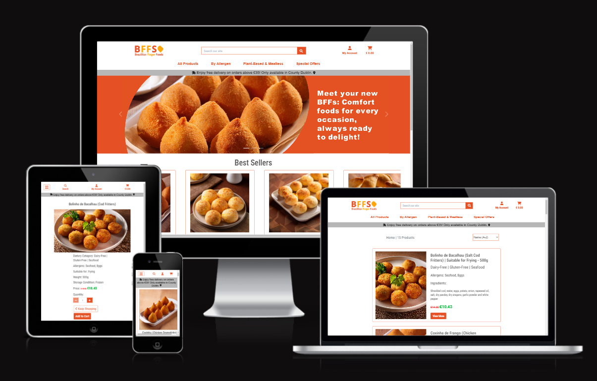

[Visit my website here](https://bffs-brazilian-finger-foods-99657e2a95f1.herokuapp.com/)


BFFs is an online store specializing in frozen Brazilian appetizers, focusing on delivering quality snacks in an easy and intuitive manner. The e-commerce platform is accessible through all browsers and fully responsive across different screen sizes.

### Features for Users
Through the web application, users can:

- Browse the store as guests.
- Register for an account.
- Explore products by category and price.
- View, add, and edit products in their shopping bag.
- As registered users, access their order history.
- Sign up for promotional newsletters.

### Features for the Store Owner
The store owner can:

- Manage products, quickly toggle best-seller status (visible on the home page) and edit prices.
- Manage batches with full CRUD functionality, allowing them to:
  - Create discounts.
  - Edit existing batches.
  - Delete batches.

### Feel free to Test my Web Application
For purchase you can use the following [Stripe Dummy Card](https://stripe.com/docs/testing) details:

- Card Number: 4242424242424242
- 3D Secure Auth Number: 4000 0027 6000 3184
- Exp Date: Any date in the future using the format MM/YY
- CVN: any 3 digit number
- Postcode (Card): any 5 numerals  

For Django Admin access with relevant sign-in credentials use this link: [BFFs Django Admin](https://bffs-brazilian-finger-foods-99657e2a95f1.herokuapp.com/admin/)

For access to Shop Admin panel in the frontend view with relevant sign-in credentials use: [BFFS Shop Admin](https://bffs-brazilian-finger-foods-99657e2a95f1.herokuapp.com/shop_admin/)


## Readme - Table of Contents

1. [Introduction](#1-introduction)

2. [UX Design](#2-ux-design)

    2.1. [Strategy/Scope and Structural Plane](#21-strategyscope-and-structural-plane)

    2.2. [User Stories](#22-user-stories)
    
    2.3. [Skeleton & Surface Planes](#23-skeleton--surface-planes)

    2.4. [Design](#24-design)

    2.5. [Agile and Project Managing](#25-agile-and-project-managing)

    2.5. [Marketing Techniques](#26-marketing-techniques)

3. [Features](#3-features)

    3.1. [User View](#31-user-view)

    3.2. [CRUD Functionality](#32-crud-functionality)

    3.3. [Future Showcase](#33-features-showcase)

    3.4. [Future Features](#34-future-features)

4. [Technologies Used](#4-technologies-used)  

    4.1. [Languages Used](#41-languages-used)

    4.2. [Frameworks, Libraries & Programs Used](#42---frameworks-libraries-technologies--programs-used)

5. [Testing](#5-testing)

6. [Deployment](#6-deployment)

    6.1. [Code Institute PostgreSQL Database](#61-code-institute-postgresql-database)

    6.2. [Connecting to GitHub](#62-connecting-to-github)

    6.3. [Django Project Setup](#63-django-project-setup) 

    6.4. [Heroku Deployment](#64-heroku-deployment)

    6.5. [Clone Project](#65-make-a-local-clone-project)

    6.6. [AWS Bucket Config](#66-aws-bucket-config)

    6.7. [Stripe Config](#67-stripe-config)

    6.8. [Make a Local Clone Project](#68-aws-bucket-config)

    6.9. [Fork Project](#69-fork-project)


7. [Credits](#7-credits)

   7.1. [Content](#71-content)

   7.2. [Media](#72-media)

   7.3. [Acknowlegements](#73-acknowlegements)


## **1. Introduction**

BFF would consist of a small business specializing in Brazilian appetizers in Dublin. The growing Brazilian community and the cosmopolitan nature of the Irish capital—where cuisines from all over the world are represented—make this business venture promising.

An acronym for Brazilian Finger Foods, BFFs is also a play on the phrase Best Friends Forever, bringing originality to the brand name. The dual meaning evokes an affectionate relationship with the comfort foods sold on the site. Acronyms are generally easier to remember, aiding in brand marketing.

Like many small businesses, given the current real estate crisis, BFF focuses on selling its products online, avoiding needing a fixed store or headquarters. This approach aims to boost sales and strengthen the brand through an attractive e-commerce platform. The sale of frozen products in the food industry offers a significant advantage: their relative longevity, with a shelf life of up to a year. This allows for better planning. The web application on the shop owner’s side includes tools for managing sales and offering discounts on products that have been in stock longer.

As an e-commerce platform, BFFs a is a fully functional e-commerce solution, combining frontend and backend tools to provide an intuitive, simple, and efficient shopping experience. It also automates billing, order processing, and stock management.

[Back to top](#readme---table-of-contents)

## **2. UX Design**

### **2.1. Strategy/Scope and Structural Plane**

Overall, the primary objective of this project was to develop an e-commerce store that met the assessment criteria of the Code Institute's Project 5: E-Commerce Module, using the Django framework. The platform was required to function as a responsive online store, integrating Stripe as the payment system, providing user and guest views for authentication (via Django Allauth), and incorporating store features alongside a demonstration of marketing and SEO skills.

I have some experience in the catering industry, where stock control was one of my responsibilities as a catering assistant. Drawing from this experience, I implemented a few ideas in the Shop Admin section within the limited time available to develop the platform. Additionally, during the creation of user stories, having completed the mock project Boutique Ado—which successfully covers most customer/user experiences—I found it interesting to add some additional nuance to the shop owner functionalities. Unfortunately, I was unable to implement all the planned features, opting to exclude some "could-have" stories (as per the MoSCoW prioritisation method) from the MVP.

From the client’s perspective, it was important to feature engaging text, appealing images, and a design that would entice users to “crave” the products. Through benchmarking several Brazilian brands, I identified the key elements they use to promote similar products and incorporated them into the website. Furthermore, a primary UX goal for the web application was to convey trustworthiness, ensuring that end users would feel confident and safe when making a purchase.

#### E-Commerce Business Model for BFFs

BFFs operates as a Business-to-Consumer (B2C) platform, designed to bring authentic Brazilian appetisers directly to customers in Dublin. The primary purpose of the application is to offer a seamless and accessible online shopping experience for frozen Brazilian finger foods, catering to the growing Brazilian community and Ireland's diverse population. The platform enables customers to explore, order, and have their favourite appetisers delivered conveniently, emphasising high-quality products and excellent service.

The core business intent of BFFs is to provide a reliable e-commerce solution that promotes Brazilian culinary culture while addressing the operational challenges of running a small food business. By focusing on frozen products, the business ensures longevity and reduces waste, enabling better stock management. The online model allows BFFs to eliminate the need for a physical store, minimising overhead costs and extending reach to a broader audience. Key features include automated billing, real-time stock updates, and user-friendly order management for both customers and the shop admin.


[Back to top](#readme---table-of-contents)

### **2.2. User Stories**

User Stories management was conducted in accordance with Agile planning methodologies to ensure project completion. Through [GitHub Projects](https://github.com/users/hpesciotti/projects/5), user stories were created as issues and organized into boards. Groups of user stories were assigned to a Sprint and their respective milestones. The use of labels helped to define epics and their associated tasks.

Furthermore, the user stories were categorized according to the **MoSCoW Prioritization Method** as follows:
- **Must Haves**: Essential for the MVP (Minimum Viable Product).
- **Should Haves**: Important but not critical for the MVP.
- **Could Haves**: Nice to have if time allows it.
- **Won’t Haves**: Initially brainstormed but, abandoned due to time limitations.

It is important to point out that time was a significant limiting factor, and bugs considerably delayed the project, ultimately resulting in a scope change. As a result, all **Could Have** features and User Stories are not currently implemented and have been set as **Future Features**.

The complete list of User Stories is available at [GitHub Projects](https://github.com/users/hpesciotti/projects/5).

[Back to top](#readme---table-of-contents)

#### User Story #1 - Epic: Home - Must Have

As a **Customer**, I want to be able to **navigate the site's home page** so that I can **familiarize myself with the type of products and services offered, identify clearance items and special offers.**

##### Acceptance Criteria  
- **AC 1:** The home page displays a straightforward navigation menu with links to product categories, special offers, and the clearance section.  
- **AC 2:** A search bar is available and functional for quick access to the various links and categories of the products.  
- **AC 3:** A carousel container with appealing images of finger foods, summarized descriptions, and persuasive call-to-action phrases encouraging product purchases.  
- **AC 4:** A card-carousel container displaying featured products, clearance, and most sold items.

### User Story #2  - Epic: All Products/Home - Must Have

As a **Customer**, I want to be able to **view deals, clearance products, and special offers** so that I can **take advantage of special prices on products.**

#### Acceptance Criteria  
- **AC 1:** The product pages consist of sections pre-filtered by main categories in the navigation bar or a category menu.  
- **AC 2:** Clicking on a category filters the product database list to display only the selected type.  


### User Story #3  - Epic: All Products/Home - Must Have

As a **Customer**, I want to be able to **browse the products advertised** so that I can **get general information, such as product image, price, allergens, and ingredients.**

#### Acceptance Criteria  
- **AC 1:** Product pages, listed by categories, feature products displayed in a grid or list format with images, names, and prices.  
- **AC 2:** Clicking on a product redirects the user to a detailed product page.  


### User Story #4 - Epic: All Products - Must Have

As a **Customer**, I want to be able to **effortlessly find products that cater to a dietary preference or condition** so that I can **sort the available products to filter the desired appetizer (gluten-free, dairy-free, vegan) or regarding the cooking process (fried/baked) or assorted bundles.**

#### Acceptance Criteria  
- **AC 1:** A filter menu is available on the product listing page with options for:  
  - Gluten-free  
  - Dairy-free  
  - Vegan  
  - Fried  
  - Baked  
  - Assorted Bundles  
- **AC 2:** A sorting feature includes options for prices.  
- **AC 3:** Selected filters dynamically update the displayed products.  


### User Story #5 - Epic: All Products - Must Have

As a **Customer**, I want to be able to **view a product page with general information of a selected appetizer** so that I can **see ingredients, dietary information, history, and the region of Brazil.**

#### Acceptance Criteria  
- **AC 1:** The product page includes:  
  - Full-size product image  
  - Ingredients list  
  - Dietary information table  
  - Product description, including history and origin in Brazil  
- **AC 2:** The information should be presented in a responsive layout like an accordion.  


### User Story #6 - Epic: FAQ - Should Have

As a **Customer**, I want to be able to **know about storage, cooking information, and general frequently asked questions** so that I can **read about any possible doubts regarding the offered products.**

#### Acceptance Criteria  
- **AC 1:** The About page includes the following:  
  - Storage instructions  
  - Cooking or preparation guidelines  
  - A FAQ section  
- **AC 2:** The FAQ section answers common questions like shelf life, freezing compatibility, and preparation methods.  
- **AC 3:** The information is easy to navigate and clear for comprehension.


### User Story #7 - Epic: Customer Profile Page - Must Have

As a **Customer**, I want to be able to **easily create/register a user account** so that I can **manage key user information, such as address and personal details.**

#### Acceptance Criteria  
- **AC 1:** The registration page is accessible from the home page via a "Sign Up" button.  
- **AC 2:** Error messages are displayed for invalid inputs.  
- **AC 3:** Registration is handled by Django Allauth. 


### User Story #8 - Epic: Customer Profile Page - Must Have

As a **Customer**, I want to be able to **manage my account through a user profile** so that I can **manage my order history and personal information.**

#### Acceptance Criteria  
- **AC 1:** Users can access their profile via a "My Account" link in the navigation bar.  
- **AC 2:** The user profile page includes sections for:  
  - Personal details (e.g., name, email)  
  - Address details  
  - Order history (sortable by date and status)  
- **AC 3:** Users can update their information and save changes.

### User Story #9  - Epic: Customer Profile Page - Must Have

As a **Customer**, I want to be able to **effortlessly log in/ logout of my account** so that I can **efficiently access my account**

#### Acceptance Criteria  
- **AC 1:** The login page is accessible from the home page via a "Log In" button.  
- **AC 2:** Users can log in using their registered email and password.  
- **AC 3:** A "Log Out" button is always visible when the user is logged in.  
- **AC 4:** Error messages are displayed for invalid login attempts (e.g., incorrect email or password).  


### User Story #10 - Epic: All Products Pages / Checkout - Must Have

As a **Customer**, I want to be able to **easily select the quantity of products** so that I can **ensure I am purchasing the right quantity before checkout.**

#### Acceptance Criteria  
- **AC 1:** Each product page includes a quantity selector (e.g., dropdown or input field with "+" and "-" buttons).  
- **AC 2:** The quantity selector defaults to 1 but allows users to increase or decrease the quantity.  
- **AC 3:** If the quantity exceeds the available stock, an error message or alert is displayed.  


### User Story #11 - Epic: Checkout - Must Have

As a **Customer**, I want to be able to **manage my shopping bag** so that I can **check if the products selected are being added and monitor my spending.**

#### Acceptance Criteria  
- **AC 1:** The shopping bag is accessible via a cart icon in the navigation bar.  
- **AC 2:** The shopping bag displays the list of added products (names and selected quantities).  
- **AC 3:** The subtotal, taxes, and grand total are calculated and displayed.


### User Story #12 - Epic: Checkout - Should Have

As a **Customer**, I want to be able to **view notifications indicating addition, reduction and removal of items in my shopping bag** so that I can **know immediately if my actions are reflected on my shopping bag**

#### Acceptance Criteria  
- **AC 1:** A toast notification appears after any action (e.g., item added, quantity updated, item removed).
- **AC 2:** Notifications are visible for a few seconds before fading automatically.


### User Story #13 - Epic: Checkout - Should Have

As a **Customer**, I want to be able to **check out safely, entering my payment information** so that I can **be certain my personal and payment data are secure.**

#### Acceptance Criteria  
- **AC 1:** The checkout page requires users to be logged in.
- **AC 2:** Payment data is encrypted and processed securely.
- **AC 3:** An order summary (products, prices, and totals) is displayed before payment submission. 
- **AC 4:** Errors in payment details prompt a clear error message.


### User Story #14 - Epic: Checkout - Must Have

As a **Customer**, I want to be able to**visualise an order confirmation after checkout** so that I can **verify the order details and be certain that all steps of purchase were concluded with success**

#### Acceptance Criteria  
- **AC 1:** The checkout page includes fields for shipping and billing details.  
- **AC 2:** Fields include validation for required inputs (e.g., address, city, zip code).  
- **AC 3:** Payment is processed securely via Stripe integration.


### User Story #15 - Epic: Checkout - Must Have

As a **Customer**, I want to be able to **receive an email with the confirmation of my order** so that I can **be reassured that my order was confirmed.

#### Acceptance Criteria  
- **AC 1:** Upon successful payment, the system sends a confirmation email with order details.  
- **AC 2:** The email includes the order number, list of items, total amount, and delivery information.


#### User Story #16 - Epic: All Products / Customer Profile - Could Have - Future Feature

As a **Customer**, I want to be able to **read reviews of appetizers posted by other customers** so that I can **make informed purchasing decisions**.

##### Acceptance Criteria
- **AC 1:**Each product page includes a section displaying customer reviews.
- **AC 2:**Reviews include the customer’s name and comment.


### User Story #17 - Epic: All Products / Customer Profile - Could Have - Future Feature

As a **Customer**, I want to be able to **read reviews of appetizers posted by other customers** so that I can **make informed purchasing decisions.**

#### Acceptance Criteria  
- **AC 1:** Each product page includes a section displaying customer reviews.  
- **AC 2:** Reviews include the customer’s name, rating, and comment.  
- **AC 3:** Reviews are sorted by date, with the most recent appearing first.  


### User Story #18 - Epic: Admin Panel - Should Have

As a **Store Owner**, I want to be able to** Add a new product (finger food or appetizer)** so that I can **use the website to present the customers with a new product**

#### Acceptance Criteria  
- **AC 1:** The admin panel has a dedicated section for adding new products.
- **AC 2:** The product creation form includes fields from the product model.
- **AC 3:** Validation ensures all required fields are completed before submission.


### User Story #19 - Epic: Admin Panel - Should Have

As a **Store Owner**, I want to be able to **Add a new batch of an existing product** so that I can **keep records of expiry dates and quantities and maintain picture and general information of an existing product**

#### Acceptance Criteria  
- **AC 1:** The admin panel allows batch management for existing products
- **AC 2:** Store owners can add a new batch by selecting an existing product.
- **AC 3:** The batch creation form includes fields for the batch number and expiry date.
- **AC 4:** **Changed** Expired batches are flagged and excluded from active stock.


### User Story #20 - Epic: Admin Panel - Could Have - Future Feature

As a **Store Owner**, I want to be able to **Use the expiry dates or quantities to create special offers** so that I can **maintain stock control and reduce food waste and financial loss. **

#### Acceptance Criteria  
- **AC 1:** The admin panel includes a feature to create special offers for specific products, considering approaching expiry dates and overstocked products.  
- **AC 2:** Notifications alerting the store owner to create offers for products nearing expiry.
- **AC 3:** Discounted products are highlighted on the customer-facing product page with labels (e.g., "Clearance" or "Special Offer").


### User Story #21 - Epic: Admin Panel - Could Have - Future Feature

As a **Site Admin**, I want to be able to **view and manage customer orders** so that I can **track sales and ensure timely delivery.**

#### Acceptance Criteria  
- **AC 1:** Admins can view a list of all customer orders in the admin panel.  
- **AC 2:** Each order includes details like customer name, items, total, and status.  
- **AC 3:** Admins can update the order status (e.g., "Processing," "Shipped," "Delivered").  

### User Story #22 - Epic: Admin Panel - Could Have - Future Feature

As a **Store Owner**, I want to be able to**A monthly/weekly inventory of the sales sorted by products ** so that I can **plan the production of new batches or increment or decrease the batches of a particular product.**

#### Acceptance Criteria  
- **AC 1:** The admin panel provides an inventory report accessible by date range (weekly/monthly). 
- **AC 2:** The reports include:
                      - Product name.
                      - Total units sold.
                      - Revenue per product.


#### User Story #23 - Epic: Checkout - Should Have

As a **Store Owner**, I want to be able to **Have a policy page with terms and conditions** so that I can **present to the customer the general legal terms of online shopping.**

##### Acceptance Criteria
- **AC 1:** A policy page is accessible from the website footer with a link labelled "Terms and Conditions."
- **AC 2:** A checkbox confirming customer acceptance of terms is included at checkout.


#### User Story #24 - Epic: Checkout - Could Have - Future Feature

As a **Customer**, I want to be able to **apply discount codes during checkout** so that **I can redeem special offers and save money**.

##### Acceptance Criteria
- **AC 1:** The checkout page includes a field for entering discount codes.
- **AC 2:** Valid discount codes reduce the total amount.
- **AC 3:** An error message is displayed for invalid or expired codes.


#### User Story #25 - Epic: Marketing - Must Have

As a **Store Owner**, I want to be able to **have a social media presence** so that I can **promote BFFs products on social media**.

##### Acceptance Criteria
- **AC 1:** Make the brand know through Facebook Business and other relevant Social Media.
- **AC 2:** Create an newsletter.

[Back to top](#readme---table-of-contents)

### **2.3. Skeleton & Surface Planes**

#### Wireframes

The wireframes were created using **Balsamiq**. At this stage, alongside the user stories, it was possible to identify the functionalities, pages, and data to be presented in later phases.

Although the design is simple, comparing the final result with the wireframes demonstrates that the production phase successfully implemented what was proposed at the outset.

<details>
<summary>Home Desktop/Mobile</summary>

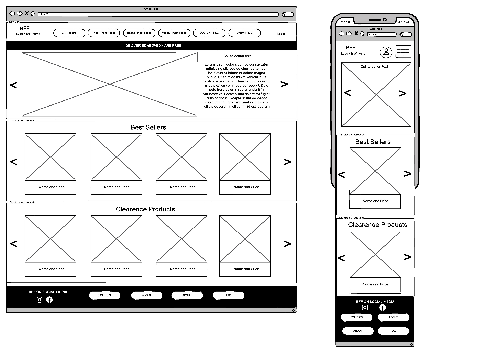

</details>


<details>
<summary>Products Page Desktop/Mobile</summary>

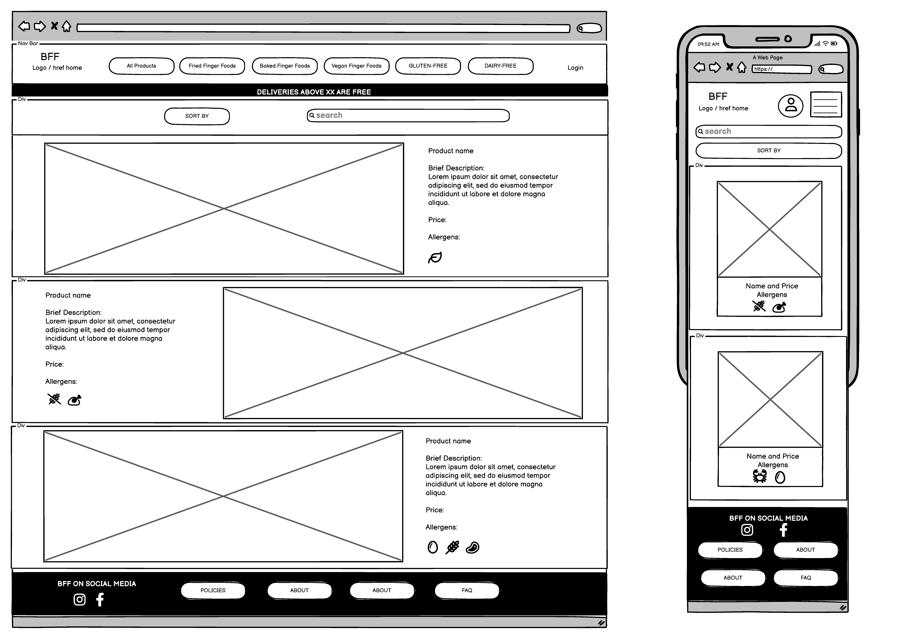

</details>

<details>
<summary>Admin Panel</summary>

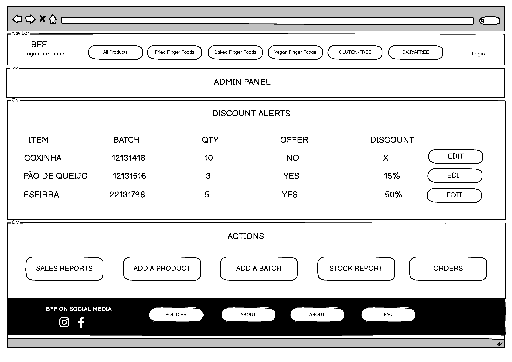

</details>

[Back to top](#readme---table-of-contents)

#### Datbase Schema

### Data Model of the Web Application "BFFs"

The data model of the web application **BFFs**, as shown in the following diagram, is centered around the **Batch** model, which serves as the link between **Product** and **Order**. The connection between these three databases ensures the main flow of the e-commerce platform, which is as follows: a **Product** is chosen (with attributes such as images, price, names – both short widget and full), and its quantity and sale price are managed by the **Batch** model. The information, stored in a session dictionary called **bag**, is then passed to the **Order** model. The **Order** model establishes a simplified connection with the **Stripe API**, generating the order and processing the payment.

It is important to note that after the connection is established between the **Order** and **Stripe**, and the confirmation email is sent, the temporary **bag** instance is used to decrement the quantity of the product in the **Batch** database.

It is emphasized that in the case of **BFFs**, the **Product** model does not represent an actual product but rather a category or even a product typology that only passes immutable data to the frontend. The connection between **Batch** and **Product** is achieved via a **ForeignKey**, allowing multiple **Batch** elements to reference the same **Product**. This connection was chosen due to the perishable nature of the products, where multiple production batches might be available to the buyer.

The **Product** model is also linked to **DietaryCategories** through a **many-to-many** relationship. This occurs because a vegan product might also be gluten-free, dairy-free, or ovo-lacto-vegetarian. This relationship enables consumers to find products that fit their dietary preferences. This connection facilitates the categorization displayed in the site's navigation menu and allows direct searches by dietary categories via the **Search Bar** (q).

User validation is handled by **Django AllAuth**, which connects to the **UserProfile** model and allows for the recording of personal and delivery information. During checkout, this information can be saved by passing data between **Order**, **Stripe Webhook**, and **UserProfile**.

Finally, the **Faq** model manages the data displayed on the **FAQs** page. Using a **for loop**, the questions and answers are passed to the frontend and presented to the user through an accordion. This database does not connect with any other databases in the web application.

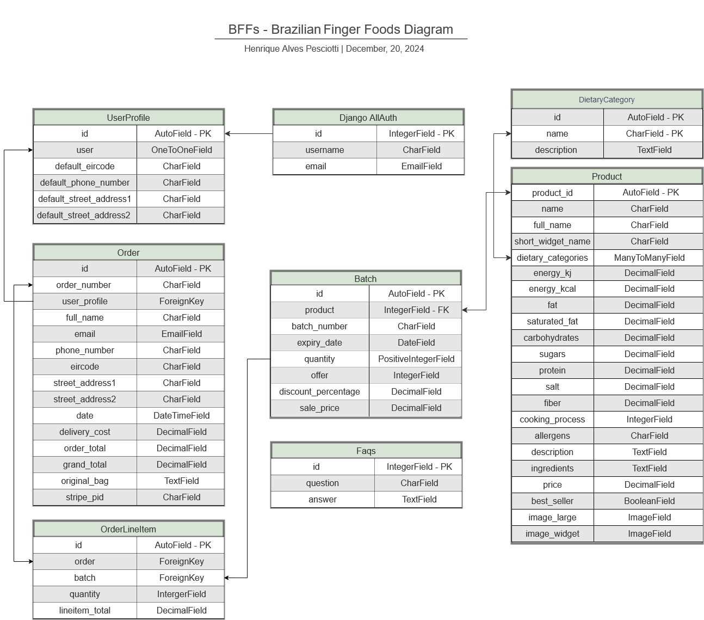

[Back to top](#readme---table-of-contents)

### **2.4. Design** 

The website design was structured in a way that would evoke a sense of urgency in the user to consume the products. In this sense, the photos of the various appetizers would play a central role in the layout of the web application. To my surprise, this became one of the biggest shortcomings at the beginning of the project. None of the major free image banks had images of Brazilian finger foods. Therefore, I had to resort to AI-generated images. In this task, I used Adobe Firefly, and with detailed prompts, a lot of trial and error, and about two days of image generation, I was able to gather all the assets for the project.

The colour palette plays an important role in evoking a "food craving feel." Although it sells Brazilian food, green and blue are rarely used by food chains in their theme. So, I decided to benchmark some of the most well-known finger food brands in my hometown. The choice of main colours was inspired by those prominent Brazilian traditional food brands, such as:
- [Boca do Forno](http://bocadoforno.com.br/)
- [Swift](https://www.swift.com.br/) – A significant source of inspiration for UX, as it is very well-structured.
- [Sodiê Doces](https://sodiedoces.com.br/)
- [Fujiyama](https://fujiyamapastelaria.com/)

The golden crispy color of bread crumb battered coxinha and its orange interior (tomato sauce and potato dough) was the inspiration for the logo, which conveys a symbol for a GPS marker, but also a tear-shaped bitten coxinha. Through the benchmark, I also noticed that these tonalities are commonly used by the researched brands. Furthermore, I tried to incorporate elements like a carousel that were both informative and visually appealing. The artwork and logos present on the website were created by me with the help of MS PowerPoint.


Image credits: https://www.minhareceita.com.br/receita/coxinha-de-frango-assada/


[Back to top](#readme---table-of-contents)

#### Colour Scheme

As mentioned, the primary colours of the site are inspired by the interior and exterior colours of a coxinha. These shades were applied consistently throughout the site on buttons, accordions, checkboxes, headers, and other elements. Hover effects incorporated colour inversions, while focus effects used transparency variations. The page background utilised shades of grey, with white employed in areas where text is more abundant.

### Colour Palette:
- #e55125 - Primary colour  
- #ffa60b - Secondary colour  
- #555555 - Text on white background  
- #373737 - Small text on grey background  
- #B7B7B7 - Free delivery section background and footer  
- #ffffff - Main element background  

Since most pages in the web application have a limited number of buttons, the primary and secondary colours were used for these elements. However, in the shop admin section, where buttons are more numerous, and in user notifications, the default Bootstrap colours were adopted to ensure clearer differentiation:

### Default Bootstrap Colours:
- **Success:** #198754  
- **Danger:** #dc3545  
- **Primary:** #0d6efd  
- **Warning:** #ffc107  


<details>
<summary>Colour Contrast Grid</summary>

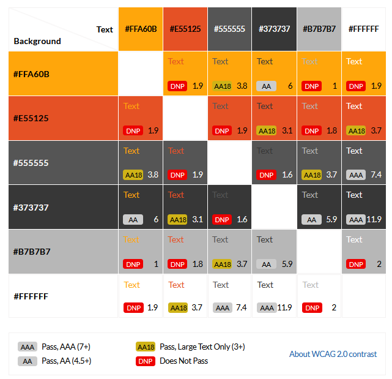

</details>

[Back to top](#readme---table-of-contents)

#### Font

Regarding the web application typography, **Open Sans** was chosen for the card elements and the nav-bar, while **Roboto Condensed** was used for the textual sections.


### **2.5. Agile and Project Managing** 

I implemented Agile Methodology during the planning phase of my e-commerce project using the Django Framework. The planning process was managed through [GitHub Projects](https://github.com/users/hpesciotti/projects/5). However, bugs and other technical challenges significantly delayed my progress compared to the initial plan.

The sprint planning for BFFs was also organised using [GitHub Milestones](https://github.com/hpesciotti/bffs-brazilian-finger-foods/milestones). Each milestone represented a sprint with tasks directly associated with User Stories to ensure efficient project tracking and completion.

<details>
<summary>Milestones</summary>

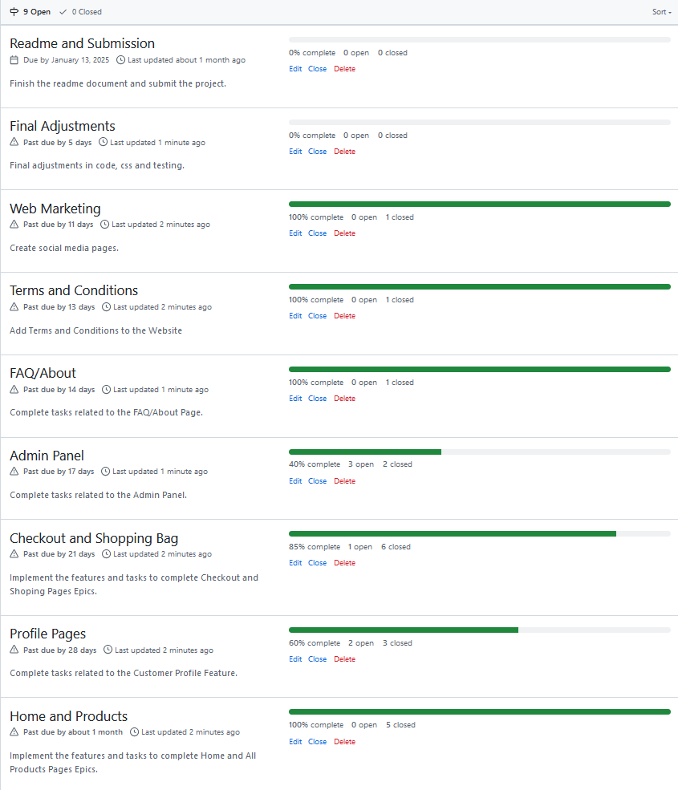

</details>

[Back to top](#readme---table-of-contents)

### **2.6. Marketing Techniques**

BFFs employs a digital techniques for marketing. The website integrates **SEO (Search Engine Optimisation)** principles to enhance visibility, while a [**Facebook Businnes Page**](https://www.facebook.com/profile.php?id=61571720907799) are used to build brand awareness and promotional future campaigns. The main goal of the marketing strategy was to benchmark against popular Brazilian food brands, to come up with a product with a design evokes a sense of craving and comfort, using keywords, appealing images and colours that resonate with the target audience. Regarding the facebook an initial call to action post was published with appealing images from the sold products.

In addition to this, **sitemap.xml** and **robots.txt** files are included to increase the site's visibility. These files are essential for **SEO**. The sitemap.xml was generated using [XML Sitemap](https://www.xml-sitemaps.com/) and included in the root folder of the project. A robots.txt file was created in the root folder to instruct search engine crawlers on how to access and crawl the site's pages.

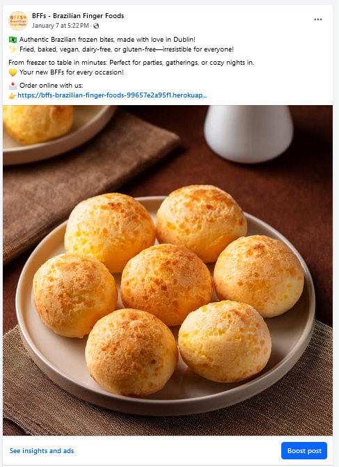

<details>
<summary>Facebook Heading</summary>

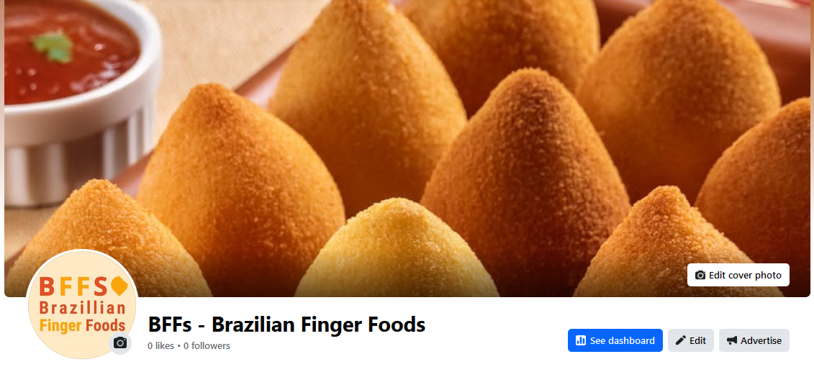

</details>

Regarding **SEO** (Search Engine Optimization), it's a good practice to create a list of **keywords** that can improve your site's visibility on search engines. To avoid keyword stuffing (excessive use of keywords), you've carefully reviewed and revised them, which is essential to keep the content relevant and natural. Using these keywords in meta tags, headings, and alt attributes for images, such as the carousel-hero element on the homepage, is an effective strategy.

The innovation of using **dynamic Django tags** for product pages is an excellent approach. By including product variables, such as name and dietary category, in the meta tags, you ensure that search engines index these pages in a personalized and dynamic way, which can improve the ranking and relevance for each item in your catalogue.

Using **WordTracker** ([link to WordTracker](https://www.wordtracker.com)) to evaluate keywords is a useful tool. Although the tool provided an analysis focused on the USA, the report you obtained seems to indicate that the dynamic meta tags, based on product variables, are more relevant than the ones you initially considered. This highlights the importance of continuously adjusting your SEO strategy.

- **Home**
~~~

  <!-- Metatags for engine search optmization -->
  <meta name="description" content="Taste the best Brazilian finger foods in Dublin. Delivered frozen to your doorstep, our comfort foods are perfect for parties and events and as a quick snack.">
  <meta name="keywords" content="Brazilian appetizers, frozen Brazilian snacks, finger foods from Brazil, Brazilian cuisine Dublin, party appetizers Dublin, Brazilian snacks Dublin">

~~~

- **Prodcuts Pages**
~~~

  <!-- Metatags for engine search optmization -->
  <meta name="description" content="Check out our amazing list of products">
  <meta name="keywords" content="{{ product.short_widget_name }}, ">

~~~

- **Prodcut Detail Pages**
~~~

  <!-- Metatags for engine search optmization -->
  <meta name="description" content="Delicious {{ product.short_widget_name }}">
  <meta name="keywords" content="Vegan, Gluten-FreeVegan{{ dietary_categories_names|join:', ' }}, {{ product.full_name }}, {{ product.allergens }}">

~~~

<details>
<summary>WordTracker results for USA</summary>

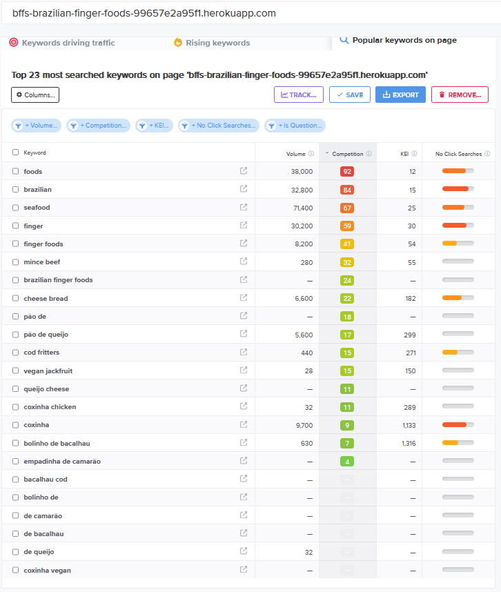

</details>

Finally, it is worth mentioning that the website features a newsletter subscription functionality in its footer via Mailchimp. The free version of this functionality does not allow automatic email sending, but the user is notified that they are subscribed to the newsletter.

### **3. Features**

#### **3.1. User view**

To ensure an engaging interface and data protection, it was necessary to establish some permissions for the website users.  
Moreover, the classification of users reflects upon the user's access to some pages.  
The following charts show the accessibility of the features per user type.

| Feature / User Type       | Unlogged User | Logged User | Superuser |
|---------------------------|---------------|-------------|-----------|
| **Home**                  | Visible       | Visible     | Visible   |
| **FAQs**                  | Visible       | Visible     | Visible   |
| **All Products**          | Visible       | Visible     | Visible   |
| **Product Details**       | Visible       | Visible     | Visible   |
| **Bag/Cart**              | Visible       | Visible     | Visible   |
| **Profile**               | Not Visible   | Visible     | Visible   |
| **Checkout**              | Visible       | Visible     | Visible   |
 **Contact Page**              | Visible       | Visible     | Visible   |
| **Shop Admin**            | Not Visible   | Not Visible | Visible   |


[Back to top](#readme---table-of-contents)

#### **3.2. CRUD Functionality**

The Create, Read, Update, Delete (CRUD) functionalities are planned for BFFs. Through the Database Model, it is clear that full CRUD functionality is available for the Batch database, meaning that a superuser has access to Create, Read, Update, and Delete operations. 

Regarding user profiles, the only operation currently available is the ability to update user details. Since cave records are crucial to the web application's purpose, deleting profiles could result in data loss (cascade effect). 

The following chart displays the CRUD functions per page per user. It's important to point out that full CRUD can only be done by a superuser at the Shop Admin Panel. I chose to center the shop admin in one concise section of the website to improve UX, also taking into account that the admin may not be as digitally knowledgeable.

| Feature / User Type       | Unlogged User | Logged User           | Superuser         |
|---------------------------|---------------|-----------------------|--------------------|
| **Home**                  | R             | R                     | R                  |
| **FQAs**                  | R             | R                     | R                  |
| **All Products**          | R             | R                     | R                  |
| **Product Details**       | R             | R                     | R                  |
| **Profile**               | X             | C, R, U, D            | C, R, U, D        |
| **Bag/Cart**              | C, R, U, D    | C, R, U, D            | C, R, U, D        |
| **Checkout**              | C, R, U, D    | C, R, U, D            | C, R, U, D        |
| **Shop Admin**            | X             | X                     | C, R, U, D        |

* Contact page is static

[Back to top](#readme---table-of-contents)

### **3.3. Features Showcase**

#### Navbar

The design ensures responsiveness and functionality suited to different user types and device sizes, optimizing user experience across platforms.

##### Desktop Version
- The desktop header features the site's logo with hover effects.
- Navigation links are presented as **nav-items** that respond to hover, focus, and active states.
- The navbar is user-type responsive:
  - For unauthenticated users, the **My Profile** link is disabled and hidden.
  - The **Shop Admin** tab is visible only to superusers, remaining hidden for other users.

<details>
<summary>Navbar Desktop</summary>


</details>

##### Mobile Version
- The mobile navbar replaces the logo with a stack bars button that serves as a drop-down menu.
- The drop-down menu lists sublinks under product categories accessible to the user.
- During testing, an additional mobile nav version was introduced for **extra small screens**:
  - In this version, the nav-item text is set to **d-none**, leaving only the Font Awesome icons visible.

<details>
<summary>Navbar Extra Small and Small Screens</summary>

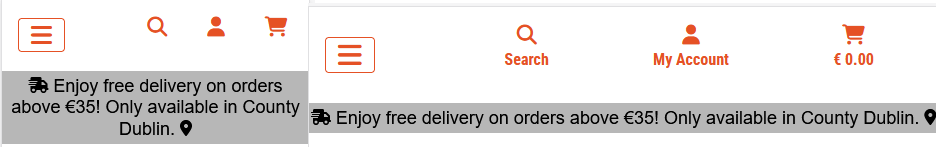

</details>

<details>

<summary>Navbar Effects</summary>

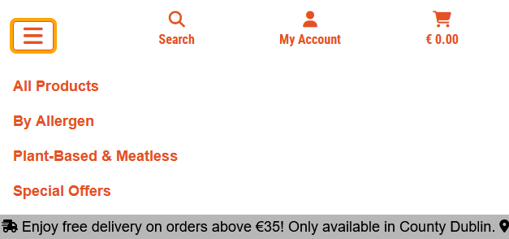

</details>

[Back to top](#readme---table-of-contents)

#### Footer

The footer complements the promotional delivery price div with a grey background, providing a stark contrast to the site's primary white spaces. It features the web application's Facebook page link with white lettering and a border-box style, along with an invitation for users to subscribe to the newsletter. Upon subscribing, users are redirected to a confirmation page powered by Mailchimp. 


<summary>Mailchimp Confirmation</summary>

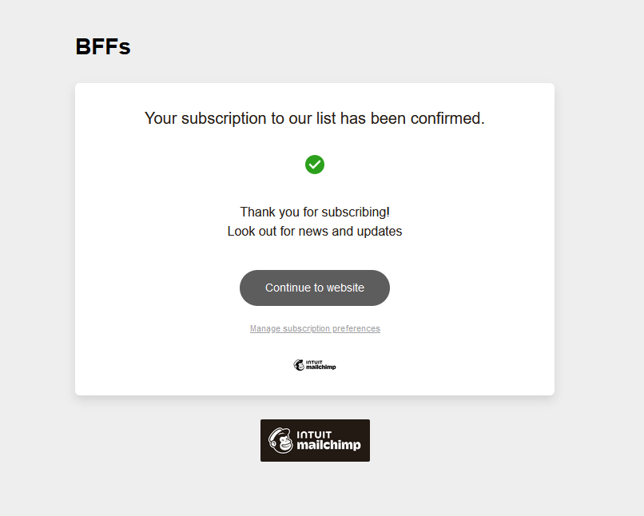

</details>

Additionally, the footer includes links to FAQs and Contact Us, as well as the site's Privacy Policy and Terms and Conditions, both generated using Free Privacy Policy. A fictional address of the appetisers company is included for demonstration purposes. The footer also features the statement “© Developed by Henrique Pesciotti, for educational purposes only,” which links back to the website's README document. 

Links to the developer’s GitHub and LinkedIn profiles are provided, each with the rel="noopener" attribute for security and performance.

<summary>Footer Mobile</summary>


</details>

[Back to top](#readme---table-of-contents)

#### Home / Index page

The home/index page is comprised of three distinct elements: the hero-carousel, Best-Sellers and Special Offers Netflix rows.

The **hero-carousel** aims to introduce the user to both the store and the brand. It consists of three rotating slides featuring eye-catching images and marketable messages with a welcoming and introductory tone. Alongside the carousel, there is an offer of free delivery for purchases over €35 within County Dublin. This offer is presented in a less prominent grey banner to avoid overshadowing the other graphic elements on the homepage. The focus remains on selling the products, not the free delivery itself.

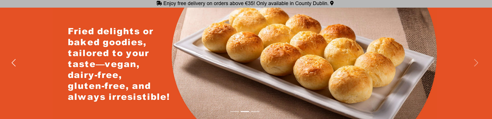


The **rows styled similarly to Netflix** (inspired by tutorial [Future Coders](https://www.youtube.com/watch?v=9nywQdjKnJI&t=971s)) are designed to quickly showcase the products available on the site, ensuring that clearance sales can be featured on the homepage. This approach supports the business model, which integrates seamlessly with the stock management system. It is worth noting that the assignment of "best-sellers" and "special offers" is managed by the superuser through the Shop Admin Panel.

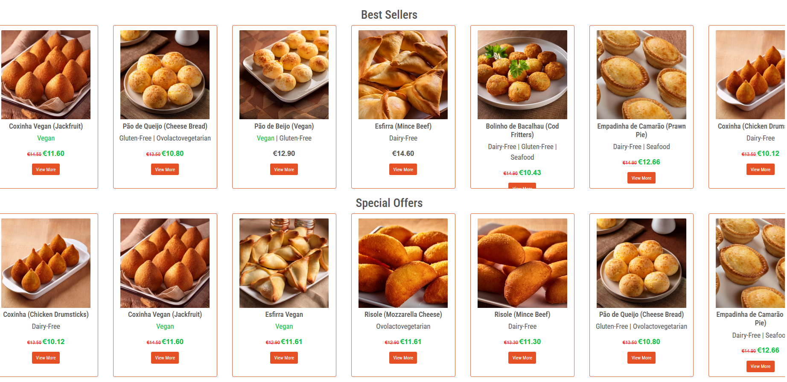

Finally, the **product cards** display the item's short name (`product.widget.name`), dietary category, price, and a "View More" button linking to the product detail page. Through filtering, promotional batches of the same product are retrieved from the database and presented on the card in a customized manner. The original price is displayed in a smaller red, strikethrough font, while the promotional price is highlighted in bold green within a span. If no promotion is available, the prices are shown in grey, matching the style of other textual elements.
 
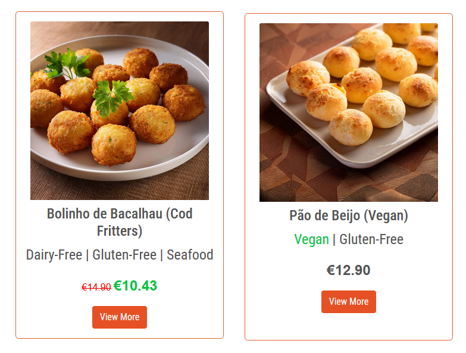

#### All Products / Filtered Products

The **All Products Page** and **Filtered Products Page** stem from an intricate search function implemented through the `all_products` view. This function leverages a combination of items from the **Products**, **Batch**, and **DietaryCategories** databases. The robust filtering system allows users to refine their searches by various categories and subcategories, all of which are showcased in a fully expandable navigation element (as shown in the provided image). Additionally, users can search by specific terms through an input form powered by the query parameter `q`.

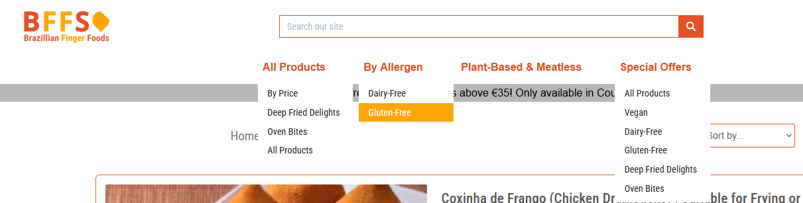

### Mobile and Desktop Display

For **mobile devices**, products are displayed as compact cards, similar to the "Netflix-style" rows found on the index page. These cards provide concise details, including:
- The product name.
- Dietary category.
- Price (with promotional and non-promotional prices differentiated).

For **larger devices**, the products are presented using **large cards**, offering detailed information about each item. These cards include:
- Full product name.
- Packaging weight.
- List of allergens.
- Ingredient details.

This dual design ensures a user-friendly experience across all devices, adapting to different screen sizes and providing relevant information efficiently. The integration of comprehensive filtering options and mobile responsiveness underscores the flexibility and accessibility of the platform.

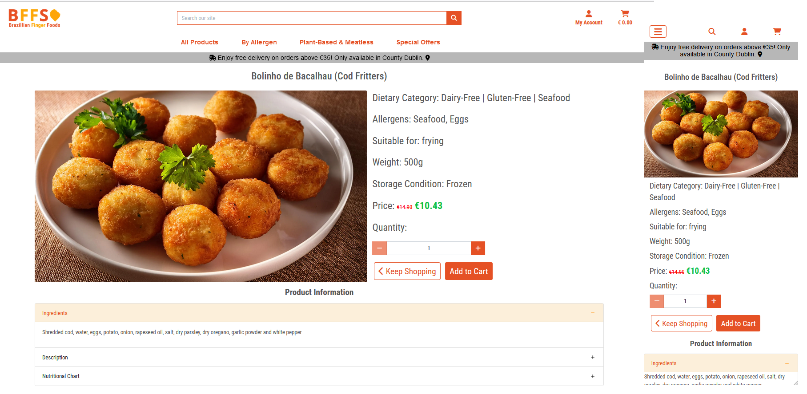

[Back to top](#readme---table-of-contents)

#### Product Detail Page

Product detail page contains the quantity of the packages, allergens, cooking process, storage condition, ingredients, historical description and nutritional chart in accordance with EU standards, with 100g, portions and daily intake of nutrients. The information should be presented in a responsive layout like an accordion.

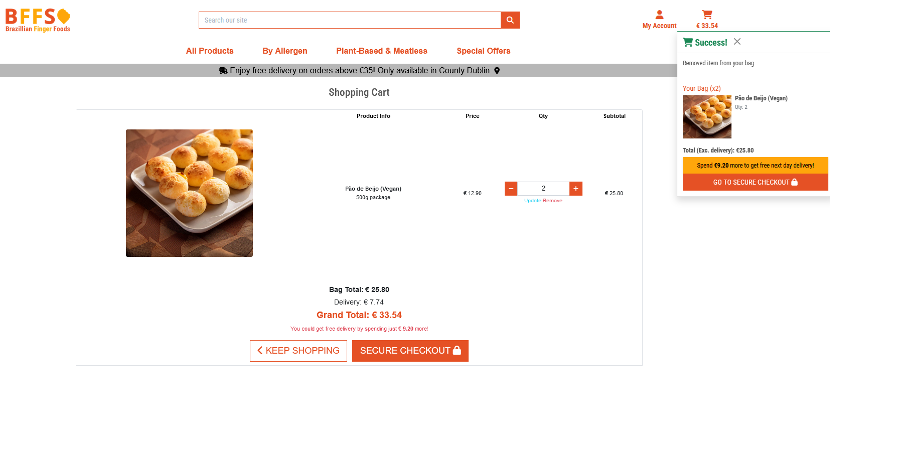


#### Bag Page

The **bag page** integrates all products selected and added to the cart. It handles prices, delivery costs, and the grand total. This functionality relies on **sesson data** to manage the main product manipulation features efficiently. The design ensures that users can view and adjust their cart with real-time updates on totals and delivery details.


[Back to top](#readme---table-of-contents)

#### Checkout

The "My Account" section is conveniently accessible via the navigation bar, allowing users to easily manage their personal details. Through the integration of **Django AllAuth**, user data validation and storage are handled seamlessly, ensuring a smooth experience. Users can update their information by filling out the profile form or by selecting the "Save my personal details" checkbox during the checkout process. This ensures that all necessary fields are captured. 

Additionally, users have the flexibility to edit their details directly on the profile page or overwrite them during checkout if they choose to update their information. This makes it easier for users to maintain and update their personal details. Finally, the **checkout page** is responsible for generating the email with the order details, as well as updating the stock.


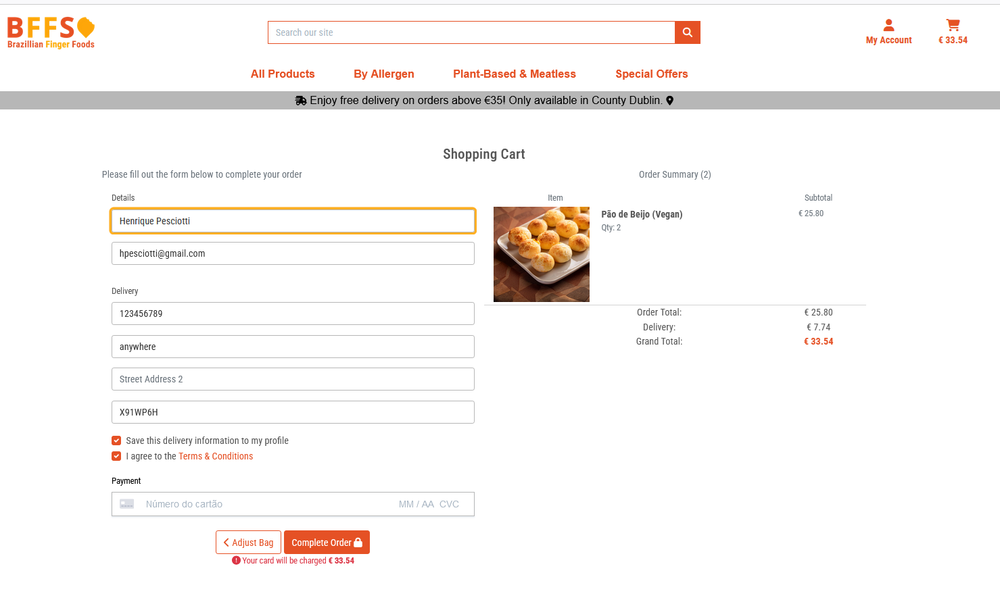

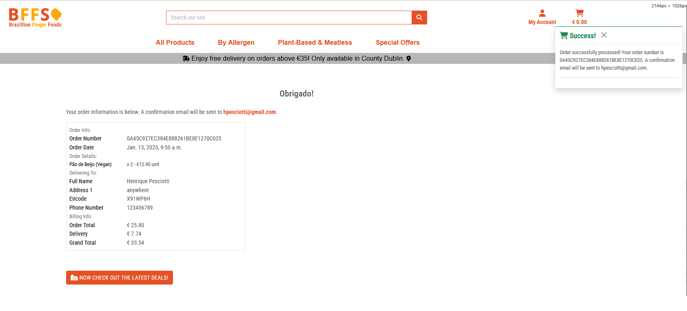

<summary>Edit Batch</summary>

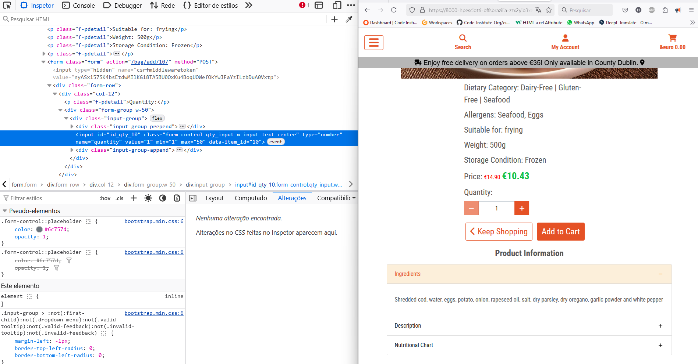

</details>
<summary>Edit Batch</summary>

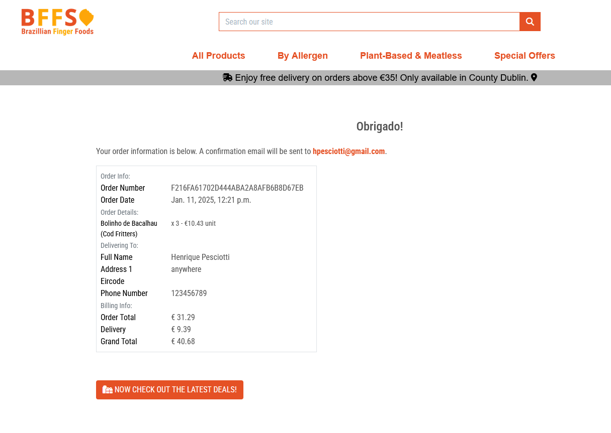

</details>
<summary>Edit Batch</summary>


</details>


[Back to top](#readme---table-of-contents)

#### Shop Admin

The **Shop Admin**, accessible with a superuser account, allows CRUD operations on the **Products** and **Batch** Databases. Regarding products, the user can edit the price (calculated by adding the production cost + a certain profit margin for a batch) and the best-seller category. Full product editing was not implemented, as products in the database behave more like categories and are not associated with a unit number in this structure. Furthermore, considering the small business nature, producing 15 types of traditional Brazilian appetizers, it's unlikely that new products would be added regularly. If the manager decides to drop a product, the product page will be set to indicate "out of stock." Validation is handled through custom messages and displayed via toasts. The pages resemble a spreadsheet with the search input form powered by the query parameter `q`. The layout is designed to be familiar to the shop administrator, who is accustomed to similar tools like MS Excel. Due to screen limitations, an `overflow-x` parameter was added to the table for small screens.

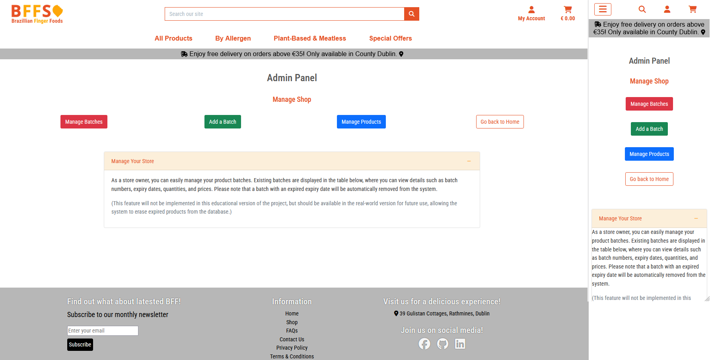

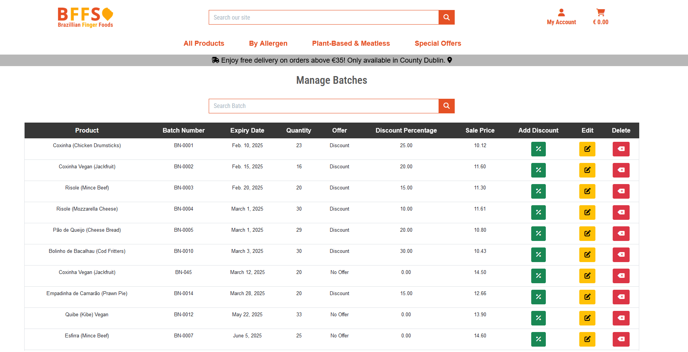

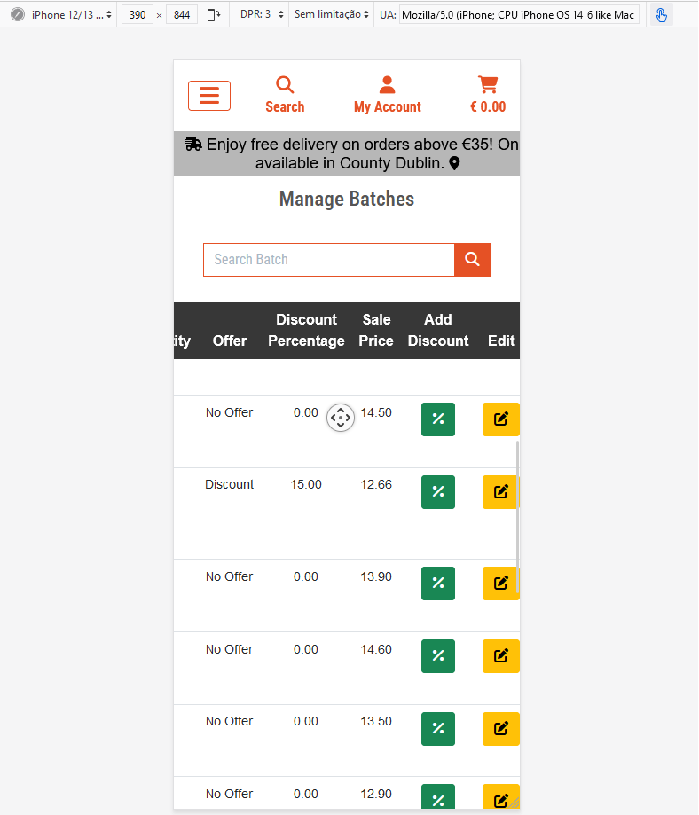

<summary>Edit Batch</summary>

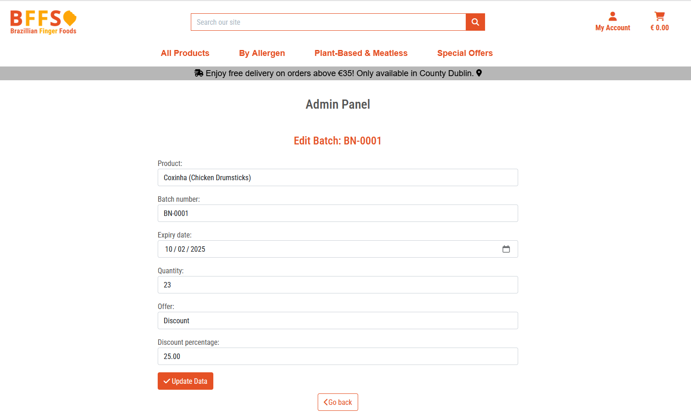

</details>

<summary>Add Batch</summary>

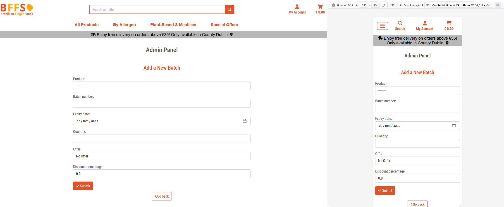

</details>

<summary>Apply Discount</summary>

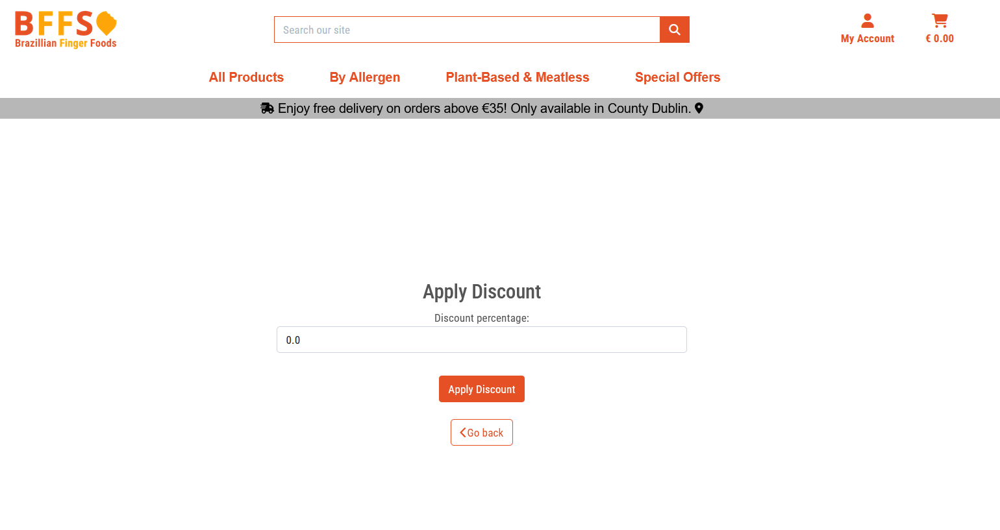

</details>

<summary>Best Sellers</summary>

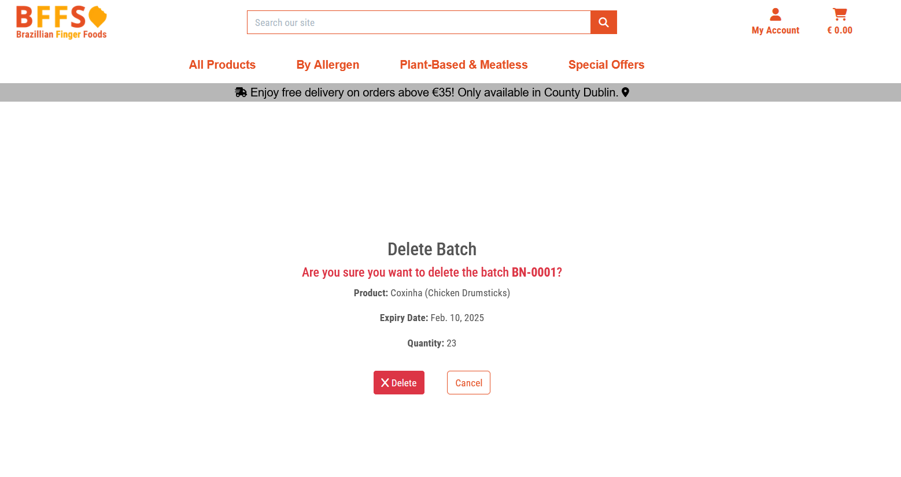

</details>

The shop admin's **Manage Batches** panel provides a quick way to set promotions, check expiry dates, and delete batches. 
This model functionality is vital for business model adopted, since it allows insight in dailly stock/production operation of the shop. Additionally, the shop manager can thoroughly edit an existing batch via a form based on the Batch model. The sale_price is calculated automatically by a method in the **Batch model**, through the multiplication of product.price and batch.discount_percentage. Accessible via shop_admin/add_a_batch, this feature allows the shop admin to **Add a New Batch** using a form. Fields such as batch number and expiry date are required to submit a new batch. 

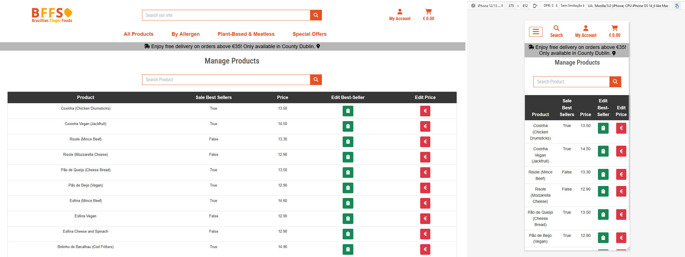


<details>

<summary>Update Price</summary>

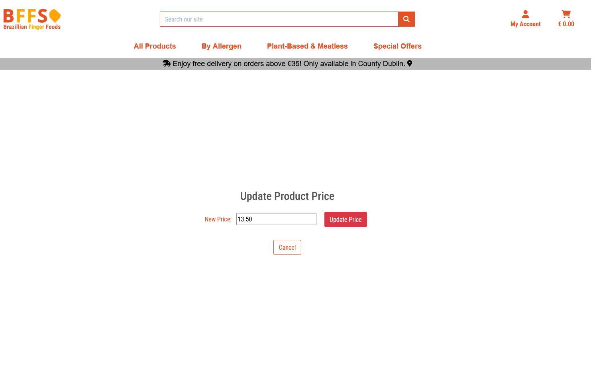

</details>

<summary>Best Sellers</summary>


</details>

[Back to top](#readme---table-of-contents)

#### Contat Us

A simple contact page with a phone number and email. The consumer is informed that the website will soon feature a live chat. However, considering a small business that handles product preparation, delivery, and both operational and financial management by a few people, implementing such a feature may not even be necessary. In digital times, particularly when I see a phone number for customer service, I feel more secure about the customer care experience.

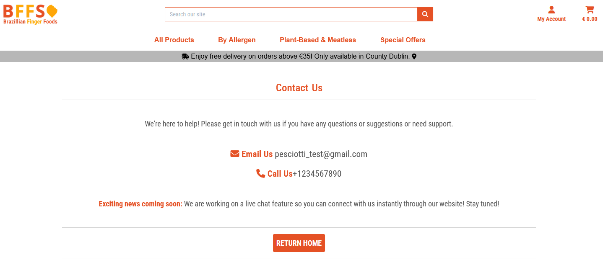

#### FAQs

Through benchmarking common customer questions about similar products, a selection of questions was saved in an **FAQ** database. The FAQ page, using an accordion layout, dynamically renders all the stored questions via a for loop. The accordion layout provides an easy-to-navigate page, accessible via the **footer**.

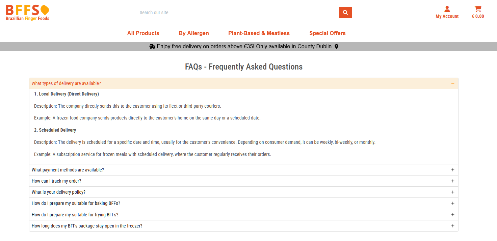

[Back to top](#readme---table-of-contents)

#### My Profile

The "My Account" section is conveniently accessible via the navigation bar, allowing users to easily manage their personal details. Through the integration of **Django AllAuth**, user data validation and storage are handled seamlessly, ensuring a smooth experience. Users can update their information by filling out the profile form or by selecting the "Save my personal details" checkbox during the checkout process. This ensures that all necessary fields are captured. 

Additionally, users have the flexibility to edit their details directly on the profile page or overwrite them during checkout if they choose to update their information. This makes it easier for users to maintain and update their personal details without any hassle, providing a seamless account management experience.

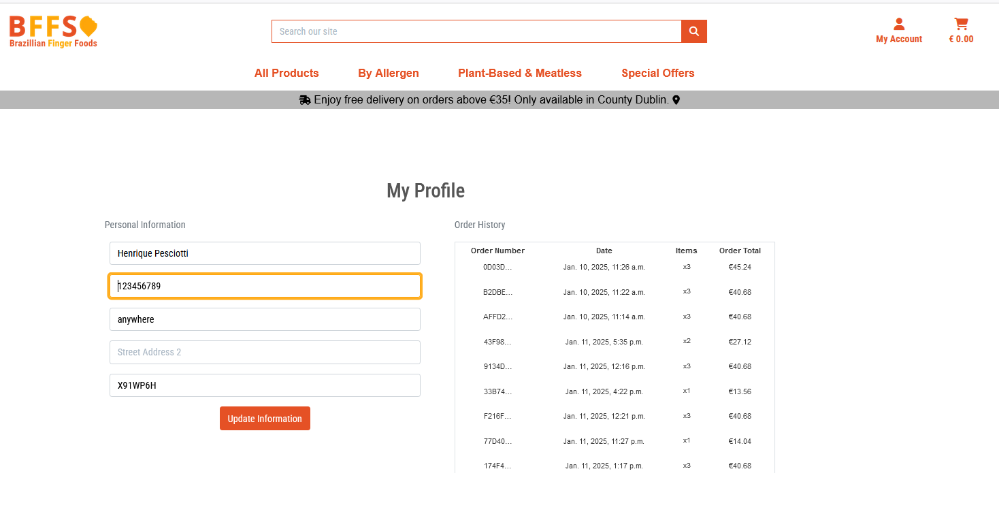

[Back to top](#readme---table-of-contents)

#### Sign In /Sign Out/Sign Up/

The Sign In Page/Sign out/Sign up/Log In are supported by Django AllAuth model. 
I added some personalisation to return error messages through toasts.

<details>
<summary>Sign Up</summary>

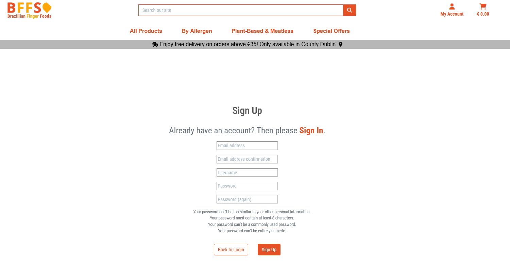

</details>

<details>

<summary>Sign Out</summary>

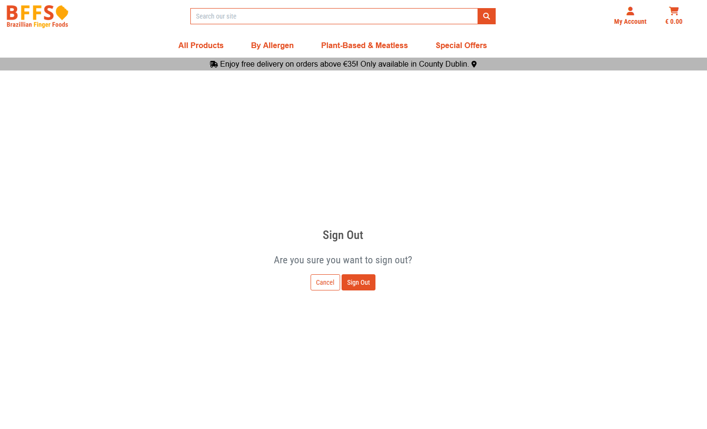

</details>

<details>

<summary>Sign In</summary>

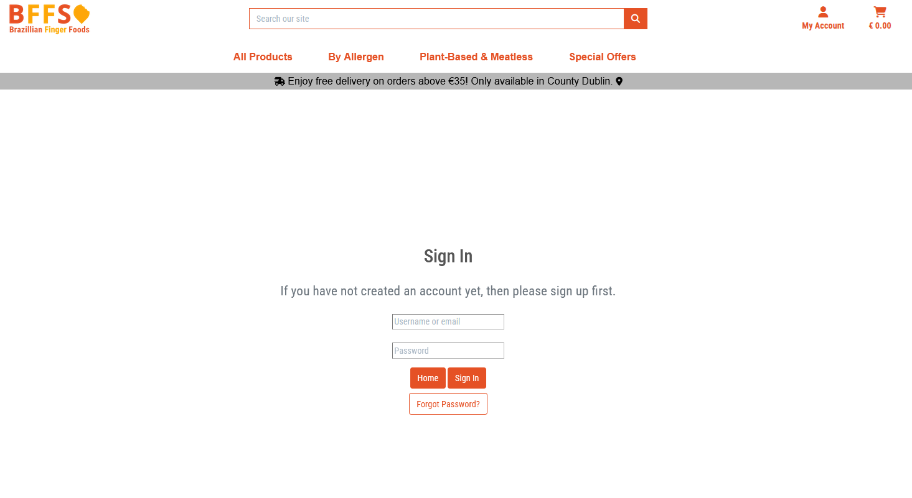

</details>

[Back to top](#readme---table-of-contents)

#### Error pages
The website has custom pages for the following errors:
- 403 - Forbidden
- 404 - Not Found
- 500 - Internal Server Error

### **3.4. Future Features**

The future features listed are primarily associated with the shop admin panel, as well as a customer reviews section. The following user stories have been considered as future features. It is worth mentioning that all were classified as "could have" according to the MoSCoW methodology.
- [User Story #16 - Product Custumer's Reviews](https://github.com/hpesciotti/bffs-brazilian-finger-foods/issues/26)
- [User Story #17 - Product Review](https://github.com/hpesciotti/bffs-brazilian-finger-foods/issues/17)
- [User Story #20 - Sales and Clearance notification on Admin Page](https://github.com/hpesciotti/bffs-brazilian-finger-foods/issues/20)
- [User Story #21 - Admin Update Delivery Status](https://github.com/hpesciotti/bffs-brazilian-finger-foods/issues/21)
- [User Story #22 - Batch and Product Planning in Admin Panel](https://github.com/hpesciotti/bffs-brazilian-finger-foods/issues/22)
- [User Story #24 - Insert Discount Codes](https://github.com/hpesciotti/bffs-brazilian-finger-foods/issues/24)

[Back to top](#readme---table-of-contents)

## **4. Technologies Used**

### **4.1. Languages Used**

- [HTML5](https://en.wikipedia.org/wiki/HTML5)

- [CSS3](https://en.wikipedia.org/wiki/Cascading_Style_Sheets)

- [Python](https://www.python.org/about/)

- [JavaScript](https://www.javascript.com/)

[Back to top](#readme---table-of-contents)

### **4.2 - Frameworks, Libraries, Technologies & Programs Used**  

- [Gitpod](https://www.gitpod.io): used for coding
- [GitHub](https://github.com/): to save and store all files for this web application
- [Git](https://git-scm.com/): used for version control
- [Django](https://www.djangoproject.com/): for building the web application
- [Google Fonts](https://fonts.google.com/): font was imported from here
- [Font Awesome](https://fontawesome.com/): icons and their associated kit were downloaded from here
- [AWS S3 Services](https://aws.amazon.com/s3/): for storing media and static data
- [Microsoft Power Point](https://www.lucidchart.com/pages/?): used to create logo and carousel images
- [Draw.io](https://aws.amazon.com/s3/): used to create Data Chart
- [Adobe Firefly](https://www.adobe.com/sensei/generative-ai/firefly.html): all pictures were generated by Adobe FireFly
- [ChatGPT](https://chat.openai.com/): for improving and making text content more engaging
- [Grammarly](https://app.grammarly.com): for spelling or grammatical inaccuracies in the text
- [Google Chrome Lighthouse](https://chromewebstore.google.com/detail/lighthouse/blipmdconlkpinefehnmjammfjpmpbjk): for auditing the performance of the web application
- [Code Institute Linter](https://pep8ci.herokuapp.com/#): for validating Python code according to PEP 8
- [MS Paint](https://www.microsoft.com/en-us/windows/paint): for editing the captured screenshots
- [Heroku](https://dashboard.heroku.com/): for deploying the terminal application
- [AllAuth](https://django-allauth.readthedocs.io/): for user authentication and account management
- [Bootstrap](https://getbootstrap.com/): for CSS classes and template rendering
- [Crispy Forms](https://pypi.org/project/crispy-bootstrap4/): for form rendering
- [Django v4.2](https://docs.djangoproject.com/en/4.2/releases/4.2/): for the web framework
- [django-heroku](https://pypi.org/project/django-heroku/): for deploying Django to Heroku
- [django-storages](https://django-storages.readthedocs.io/): for managing static and media files on AWS S3
- [gunicorn](https://pypi.org/project/gunicorn/): for running the app server
- [psycopg2](https://pypi.org/project/psycopg2/): for PostgreSQL database integration
- [stripe](https://stripe.com/docs): for payment processing
- [boto3](https://boto3.amazonaws.com/v1/documentation/api/latest/index.html): for AWS SDK to manage AWS services
- [awscli](https://aws.amazon.com/cli/): for AWS command-line tool
- [pillow](https://pillow.readthedocs.io/en/stable/): for image processing
- [s3transfer](https://s3transfer.readthedocs.io/en/latest/): for managing file uploads to AWS S3
- [sqlparse](https://buildmedia.readthedocs.org/media/pdf/sqlparse/latest/sqlparse.pdf): for SQL parsing
- [jQuery](https://code.jquery.com/jquery-3.6.0.min.js): for fast, small, and feature-rich JavaScript library
- [Popper.js](https://cdn.jsdelivr.net/npm/@popperjs/core@2.9.2/dist/umd/popper.min.js): for positioning tooltips and popovers in Bootstrap
- [Mailchimp](https://s3.amazonaws.com/downloads.mailchimp.com/js/mc-validate.js): for email marketing integration

[Back to top](#readme---table-of-contents)

## **5. Testing**

- An additional file for Testing can be found here: [Testing](https://github.com/hpesciotti/bffs-brazilian-finger-foods/blob/main/TESTING.md)

## **6. Deployment**

The website was developed using Gitpod code editor, committed to Git as a local repository, and then pushed to GitHub for storage.

## **6.1 Code Institute PostgreSQL Database**

- Navigate to [Code Institute PostgreSQL Database](https://dbs.ci-dbs.net/)
- Enter your student email address in the input field provided.
- Wait for database to be created and review the email sent to your student email inbox.

[Back to top](#readme---table-of-contents)

### **6.2. Connecting to GitHub**

To begin this project from scratch, you must first create a new GitHub repository using the [Code Institute's Template](https://github.com/Code-Institute-Org/ci-full-template). This template provides the relevant tools to get you started. To use this template:

1. Log in to [GitHub](https://github.com/) or create a new account.
2. Navigate to the above CI Full Template.
3. Click '**Use this template**' -> '**Create a new repository**'.
4. Choose a new repository name and click '**Create repository from template**'.
5. In Gitpod locate your repository and create a new workspace.

[Back to top](#readme---table-of-contents)

### **6.3. Django Project Setup**

- Install Django and all supporting libraries for BFFs: 

```
pip install asgiref==3.8.1 \
    awscli==1.36.27 \
    boto3==1.35.86 \
    botocore==1.35.86 \
    crispy-bootstrap5==2024.10 \
    dj-database-url==0.5.0 \
    Django==4.2.16 \
    django-allauth==65.3.0 \
    django-crispy-forms==2.3 \
    django-heroku==0.3.1 \
    django-storages==1.14.4 \
    docutils==0.16 \
    gunicorn==23.0.0 \
    jmespath==1.0.1 \
    pillow==11.0.0 \
    psycopg2==2.9.10 \
    pyasn1==0.6.1 \
    rsa==4.7.2 \
    s3transfer==0.10.4 \
    sqlparse==0.5.3 \
    stripe==11.4.1
```
  
- After the insatalation process run ```pip3 freeze --local > requirements.txt``` in the terminal.  
- Create a new Django project in the terminal ```django-admin startproject bffs .```
- Create a new app eg. ```python3 mangage.py startapp products```
- Register caves in **INSTALLED_APPS** in **settings.py** as 'products',
- Run ```python3 manage.py createsuperuser``` and enter credentials to create a superuser, allowing Admin access.
- Run migrations with commands: ```python3 manage.py makemigrations``` and ```python3 manage.py migrate```
- Create an **env.py** to store all confidential data such as the **DATABASE_URL** and **SECRET_KEY**. 

```import os
os.environ["DATABASE_URL"]="<CI's data base>"
os.environ.setdefault("CLOUDINARY_URL")
```

- Add envy.py to must be added to your **gitignore**, so it will not be upload to GitHub.
- Reference the file in your project's **settings.py**: 
For adding to **settings.py**:

```
import os
import dj_database_url
if os.path.exists("env.py"):
import env
```

- Replace **DATABASES** with:

```
DATABASES = {
    'default': dj_database_url.parse(os.environ.get("DATABASE_URL"))
  }
```

- Set up the templates directory in **settings.py**:
    Under ``BASE_DIR`` enter ``TEMPLATES_DIR = os.path.join(BASE_DIR, ‘templates’)``
    Update ``TEMPLATES = 'DIRS': [TEMPLATES_DIR]`` with:

```
os.path.join(BASE_DIR, 'templates'),
os.path.join(BASE_DIR, 'templates', 'allauth')
```

- Create the media, static and templates directories in top level of project file in IDE workspace.

-  Create a Procfile in the project repository for Heroku deployment, containing the following line:
web: gunicorn bffs.wsgi

-  Run migrations again to ensure all database changes are applied.

[Back to top](#readme---table-of-contents)

### **6.4. Heroku Deployment**

To start the deployment process, please follow the below steps:

- Log in to [Heroku](https://id.heroku.com/login) or create an account if you are a new user.
- Once logged in, in the Heroku Dashboard, navigate to the '**New**' button in the top, right corner, and select '**Create New App**'.
- Enter an app name and choose your region. Click '**Create App**'. 
-  In the Deploy tab, click on the '**Settings**', reach the '**Config Vars**' section and click on '**Reveal Config Vars**'. Here you will enter KEY:VALUE pairs for the app to run successfully. The KEY:VALUE pairs that you will need are your: 
   
   - Set CLOUDINARY_URL** 
   - Set DATABASE_URL**
   - Set DISABLE_COLLECTSTATIC to 1
  
- Add the Heroku host name into **ALLOWED_HOSTS** in your projects **settings.py file** -> ```['herokuappname', ‘localhost’, ‘8000 port url’].```
- Once you are sure that you have set up the required files including your requirements.txt and Procfile, you have ensured that **DEBUG=False**, save your project, add the files, commit for initial deployment and push the data to GitHub.
- Go to the '**Deploy**' tab and choose GitHub as the Deployment method.
- Search for the repository name, select the branch that you would like to build from, and connect it via the '**Connect**' button.
-  Choose from '**Automatic**' or '**Manual**' deployment options, I chose the 'Manual' deployment method. Click '**Deploy Branch**'.
- Once the waiting period for the app to build has finished, click the '**View**' link to bring you to your newly deployed site. If you receive any errors, Heroku will display a reason in the app build log for you to investigate. *

[Back to top](#readme---table-of-contents)

### **6.5. Google Mail Setup**

- Setup a Gmail Account that will be used to hold and store the emails for your project.
- Logged in, navigate to **Settings** -> **Other Google Account Settings** -> **Accounts** -> **Import** -> **Other Account Settings**
- Activate 2-Step Verification
- Once verified access **App Passwords** -> **Other** -> enter a name for the password, eg BFFs.
- Click **Create** -> copy the 16 digit password that is generated.
    ```
    # Gmail Config
    if 'DEVELOPMENT' in os.environ:
        EMAIL_BACKEND = 'django.core.mail.backends.console.EmailBackend'
        DEFAULT_FROM_EMAIL = 'bffs@example.com'
    else:
        EMAIL_BACKEND = 'django.core.mail.backends.smtp.EmailBackend'
        EMAIL_USE_TLS = True
        EMAIL_PORT = 587
        EMAIL_HOST = 'smtp.gmail.com'
        EMAIL_HOST_USER = os.environ.get('EMAIL_HOST_USER')
        EMAIL_HOST_PASSWORD = os.environ.get('EMAIL_HOST_PASS')
        DEFAULT_FROM_EMAIL = os.environ.get('EMAIL_HOST_USER')
    ```
- Add EMAIL_HOST_PASS, EMAIL_HOST_USER variable, password and email address to your Heroku Config Vars

[Back to top](#readme---table-of-contents)

### **6.6. AWS Bucket Config**

[AWS](https://aws.amazon.com) is used to store the media and static files online for BFFs. Please follow the below steps to set it up for yourself:

- Setup AWS Account and Login
- Create a new S3 Bucket -> name it to match your Heroku App name -> Choose the region closest to you.
- Allow **Clock All Public Access**, tick 'Bucket will be public' in order for the bucket to connect to Heroku. 
- In **Object Ownership** -> **ACLS Enabled** -> **Bucket Owner Preferred**.
- **Properties** tab -> turn on static web hosting and add 'index.html' and 'error.html' into the correct fields -> click **Save**
- In the **Permissions** tab, paste in the following CORS config:

   ```
	[
		{
			"AllowedHeaders": [
				"Authorization"
			],
			"AllowedMethods": [
				"GET"
			],
			"AllowedOrigins": [
				"*"
			],
			"ExposeHeaders": []
		}
	]
	```
- Copy your **ARN** string.
- From the **Bucket Policy** tab, select the **Policy Generator** link, and use the following steps:
	- Policy Type: **S3 Bucket Policy**
	- Effect: **Allow**
	- Principal: `*`
	- Actions: **GetObject**
	- Amazon Resource Name (ARN): **paste-your-ARN-here**
	- Click **Add Statement**
	- Click **Generate Policy**
	- Copy the entire Policy, and paste it into the **Bucket Policy Editor**

		```shell
		{
			"Id": "Policy1234567890",
			"Version": "2012-10-17",
			"Statement": [
				{
					"Sid": "Stmt1234567890",
					"Action": [
						"s3:GetObject"
					],
					"Effect": "Allow",
					"Resource": "arn:aws:s3:::bucket-name/*"
					"Principal": "*",
				}
			]
		}
		```
  - Before you click "Save", add `/*` to the end of the Resource key in the Bucket Policy Editor (like above).
	- Click **Save**.
 - In the **ACL - Access Control List** -> **Edit** -> enable **List** for **Everyone(Public Access)** -> Accept the warning.

[Back to top](#readme---table-of-contents)

#### **AWS IAM**

- AWS Services Menu -> **Create New Group** -> add name eg. 'group-project-name'.
- Navigate from there to **REview Policy** page -> **User Groups** -> Select newly named group.
- Navigate to **Permissions** tab -> **Add Permissions** -> Click **Attach Policies**
- Select policy -> **Add Permissions** at the bottom, click when finished.
- From **JSON** tab -> select **Import Managed Policy** link -> search for **S3** -> select **Amazon3FullAccess** policy -> **Import**.
- Copy **ARN** from S3 Bucket again ->

   ```
		{
			"Version": "2012-10-17",
			"Statement": [
				{
					"Effect": "Allow",
					"Action": "s3:*",
					"Resource": [
						"arn:aws:s3:::bucket-name",
						"arn:aws:s3:::bucket-name/*"
					]
				}
			]
		}
	```
- Click **Review Policy** -> name eg. 'policy-bffs' -> enter a description -> **Create Policy**
- Search for your new policy and click it to **Attach Policy**
- **User Groups** -> **Add User** -> name eg. 'user-bffs'
- For **Select AWS Access Type** -> select **Programmatic Access** -> Add group to 'user-bffs' -> **Review User** -> **Create User**.
- Find **Download.csv** button to download immediately and save a copy.
    - This contains the user's **Access key ID** and **Secret access key**.
	- `AWS_ACCESS_KEY_ID` = **Access key ID**
	- `AWS_SECRET_ACCESS_KEY` = **Secret access key** 

[Back to top](#readme---table-of-contents)

#### **Media Folder Setup**
 - In Heroku Config Vars, remove `DISABLE_COLLECTSTATIC`.
 - In AWS S3 create a new folder -> **media** -> Add project images -> **Manage Public Permissions** -> **Grant public read access to the objects** -> **Upload**

#### Django AWS Connect

 - Packages needed to use AWS S3 Buckets in Django:
   - `pip3 install boto3`
   - `pip3 install django-storages`
 - In settings.py add:
   ```
   INSTALLED_APPS = [
       'storages',
   ]
 - In env.py ensure AWS variables are present for `AWS_ACCESS_KEY_ID`, `AWS_SECRET_ACCESS_KEY` and environment variable paths are in settings.py:
   ```
   import os
   from pathlib import Path
   import dj_database_url

   if os.path.isfile('env.py'):
   import env
   ```
 - Ensure DATABASES are set up to connect with Heroku Postgres server in production vs SQLite3 when in local development.
   ```
   if "DATABASE_URL" in os.environ:
	DATABASES = {
		"default": dj_database_url.parse(os.environ.get("DATABASE_URL"))
	}
    else:
	DATABASES = {
		"default": {
			"ENGINE": "django.db.backends.sqlite3",
			"NAME": os.path.join(BASE_DIR, "db.sqlite3"),
		}
	}
    ```
 - Setup media and static file storage in settings.py:
   ```
   STATIC_URL = "/static/"
   STATICFILES_DIRS = (os.path.join(BASE_DIR, "static"),)

   MEDIA_URL = "/media/"
   MEDIA_ROOT = os.path.join(BASE_DIR, "media")
   ```
 - S3 Bucket config in settings.py is as follows:
   ```
    if 'USE_AWS' in os.environ:
        # Cache Control
        AWS_S3_OBJECT_PARAMETERS = {
            'Expires': 'Thu, 31 Dec 2099 20:00:00 GMT',
            'CacheControl': 'max-age=9460800',
        }

        # Bucket Config
        AWS_STORAGE_BUCKET_NAME = 'bffs-static'
        AWS_S3_REGION_NAME = 'eu-north-1'
        AWS_ACCESS_KEY_ID = os.environ.get('AWS_ACCESS_KEY_ID')
        AWS_SECRET_ACCESS_KEY = os.environ.get('AWS_SECRET_ACCESS_KEY')
        AWS_S3_CUSTOM_DOMAIN = f'{AWS_STORAGE_BUCKET_NAME}.s3.amazonaws.com'

        # Static and media files
        STATICFILES_STORAGE = 'custom_storages.StaticStorage'
        STATICFILES_LOCATION = 'static'
        DEFAULT_FILE_STORAGE = 'custom_storages.MediaStorage'
        MEDIAFILES_LOCATION = 'media'

        # Override static and media URLs in production
        STATIC_URL = f'https://{AWS_S3_CUSTOM_DOMAIN}/{STATICFILES_LOCATION}/'
        MEDIA_URL = f'https://{AWS_S3_CUSTOM_DOMAIN}/{MEDIAFILES_LOCATION}/'
    ```
 - In the main project directory create a 'custom_storages.py' file and add the following:
   ```
     from django.conf import settings
     from storages.backends.s3boto3 import S3Boto3Storage

    class StaticStorage(S3Boto3Storage):
      location = settings.STATICFILES_LOCATION

    class MediaStorage(S3Boto3Storage):
      location = settings.MEDIAFILES_LOCATION
   ```
 - AWS S3 Bucket is now connected through the above settings and Heroku's Config Vars.

[Back to top](#readme---table-of-contents)

### **6.7. Stripe Config**

Stripe's API is used to handle BFFs payment system. To setup follow the below steps:

 - Create and log in to a Stripe account.
 - In the Stripe Dashboard -> **Get your test API keys.**
 - Add your `STRIPE_PUBLIC_KEY` and `STRIPE_SECRET_KEY` to your env.py, connect to your settings.py using your environment variables and then enter them into your project's Heroku Config Vars.
 - Including Stripe's Webhooks creates a failsafe if a customer exits the page during payment authorisation. In Stripe's Dashboard -> **Developers** -> **Webhooks** -> **Add Endpoint**: 'herokuapp url/checkout/wh'
 - Choose **Retrieve all events** -> **Add Endpoint**.
 - Add new key **STRIPE_WH_SECRET** to env.py, settings.py and Heroku Config Vars as before.

[Back to top](#readme---table-of-contents)

### **6.8. Make a Local Clone Project**

A local clone of this repository can be made on GitHub. Please follow the below steps:

- Navigate to GitHub and log in.
- The [BFFs](https://github.com/hpesciotti/bffs-brazilian-finger-foods/) can be found at this location.
- Above the repository file section, locate the '**Code**' button.
- Click on this button and choose your clone method from HTTPS, SSH or GitHub CLI, copy the URL to your clipboard by clicking the '**Copy**' button.
- Open your Git Bash Terminal.
- Change the current working directory to the location you want the cloned directory to be made.
- Type `git clone` and paste in the copied URL from step 4.
- Press '**Enter**' for the local clone to be created.
- Using the ``pip3 install -r requirements.txt`` command, the dependencies and libraries needed for FreeFido will be installed.
- Set up your **env.py** file and from the above steps for Cloudinary and ElephantSQL, gather the Cloudinary API key and the Elephant SQL url for additon to your code.
- Ensure that your **env.py** file is placed in your **.gitignore** file and follow the remaining steps in the above Django Project Setup section before pushing your code to GitHub.

[Back to top](#readme---table-of-contents)

### **6.9. Fork Project**

A copy of the original repository can be made through GitHub. Please follow the below steps to fork this repository:  

- Navigate to GitHub and log in.  
- Once logged in, navigate to this repository using this link [BFFs](https://github.com/hpesciotti/bffs-brazilian-finger-foods/).
- Above the repository file section and to the top, right of the page is the '**Fork**' button, click on this to make a fork of this repository.
- You should now have access to a forked copy of this repository in your Github account.
- Follow the above Django Project Steps if you wish to work on the project.

[Back to top](#readme---table-of-contents)

## **7. Credits**

### **7.1. Content**

- Code Institute - Boutique Ado: Django E-commerce Project.

- [Django Docs](https://docs.djangoproject.com/en/dev/ref/contrib/admin/#django.contrib.admin.ModelAdmin.readonly_fields): For general info on Django functionalites

- [Code Institute Slack](https://code-institute-room.slack.com/archives/C7EJUQT2N/p1656408408414069?thread_ts=1656406218.111909&cid=C7EJUQT2N'): Bug Boostrap 5 and Crispy Forms

- [Code Institute Slack](https://code-institute-room.slack.com/archives/C7HS3U3AP/p1727203894349779?thread_ts=1727165566.204429&cid=C7HS3U3AP): Bug Django 5.1.4 and AWS S3 Bucket.

- [Stack Overflow](https://stackoverflow.com/questions/3540770/mailchimp-jquery-conflict): Mailchimp Bug 10

- [Future Coders](https://www.youtube.com/watch?v=9nywQdjKnJI&t=971s): Implementing Netflix style rows.

- [Boostrap Docs](https://getbootstrap.com/docs/5.3/getting-started/introduction/): Implementing nav bar, accordion, focus, hover effects, grid structure and more.

- [Amy Richardson - Everneed Repository](https://github.com/amylour/everneed): for Readme and Footer.

[Back to top](#readme---table-of-contents)


### **7.2. Media**

- [Font Awesome](https://fontawesome.com/): for the icons used in the footer of the application.

- [Adobe Firefly](https://www.adobe.com/sensei/generative-ai/firefly.html): As explained before, all pictures were generated by Adobe FireFly.

[Back to top](#readme---table-of-contents)

### **7.3. Acknowlegements**

### Acknowledgements

- **My informal mentor and great friend, [Bruno Dias](https://github.com/brunoald/)** for helping me out debugging the Stripe Webhook. Also for all the support throughout the course and lifting my mood, especially regarding my imposter syndrome.

- **My mentor, Darío Carrasquel**, for his support and constructive feedback.

- **My sister Patrícia**, for testing the web application.

- **My partner, Joana**, for the testing, feedback, late-night snacks, and all the emotional and financial support. I couldn't have done this without you.

[Back to top](#readme---table-of-contents)

