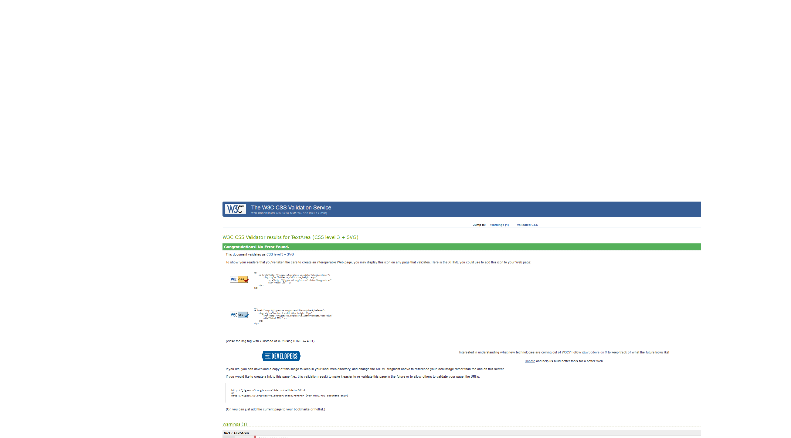
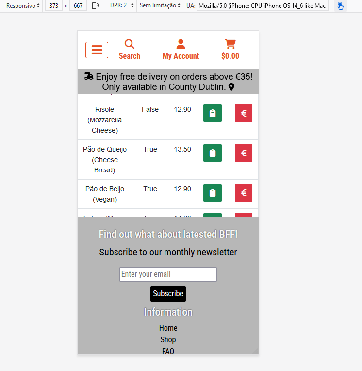

# BFFs | Brazilian Finger Foods


[Visit my website here](https://bffs-brazilian-finger-foods-99657e2a95f1.herokuapp.com/)

Return back to the [README.md](README.md) file.

## Testing - Table of Contents  

5. [Testing](#2-ux-design)

    5.1. [Validation](#51-validation)
      5.1.1. [Html Validation](#html-validation)
      5.1.2. [Performance Lighthouse](#performance-lighthouse)
         5.1.2.1. [Lighthouse Validator Desktop Pages](#lighthouse-validator-desktop-pages)
         5.1.2.2. [Lighthouse Validator Mobile Pages](#lighthouse-validator-mobile-pages)
      5.1.3. [Python PEP 8 Validation](#python-pep-8-validation)
         5.1.3.1. [Python PEP 8 Validator](#python-pep-8-validator)
      5.1.4. [CSS Validation](#css-validation)
    5.2. [Manual Testing](#52-manual-testing)
    5.3. [Bugs & Fixes](#53-bugs--fixes)
      5.3.1. [Bug 01](#bug-01)
      5.3.2. [Bug 02](#bug-02)
      5.3.3. [Bug 03](#bug-03)
      5.3.4. [Bug 04](#bug-04)
      5.3.5. [Bug 06](#bug-06)
      5.3.6. [Bug 07](#bug-07)
    5.4. [Unsolved Bugs](#54-unsolved-bugs)

### **5.1. Validation**

#### **Html Validation**

html validation was conducted through [HTML W3C Validator](https://validator.w3.org). 
The following images are validation screenshots taken from the service with the website Heroku live link. 
 - The validator could not test the pages that required logged in user (profile User Section) superuser credentials (Reports Section) and error pages (500, 403 and 404).
 - All the pages were valid

##### W3C Html Validator
| Page         | Status                 | Screenshot                                                |
|--------------|------------------------|-----------------------------------------------------------|
| Add Batches        | No errors or warnings   | <details><summary>Show Screenshot</summary>  </details> |
| Apply Discount     | No errors or warnings   | <details><summary>Show Screenshot</summary>  </details> |
| Bag     | No errors or warnings   | <details><summary>Show Screenshot</summary>  </details> |
| Checkout Success   | No errors or warnings   | <details><summary>Show Screenshot</summary>  </details> |
| Checkout       | No errors or warnings   | <details><summary>Show Screenshot</summary>  </details> |
| Delete Batch | No errors or warnings   | <details><summary>Show Screenshot</summary>  </details> |
| FAQs   | No errors or warnings   | <details><summary>Show Screenshot</summary>  </details> |
| Index        | No errors or warnings   | <details><summary>Show Screenshot</summary>  </details> |
| Log Out   | No errors or warnings   | <details><summary>Show Screenshot</summary>  </details> |
| Manage Batches   | No errors or warnings   | <details><summary>Show Screenshot</summary>  </details> |
| Product Details   | No errors or warnings   | <details><summary>Show Screenshot</summary>  </details> |
| All Products   | No errors or warnings   | <details><summary>Show Screenshot</summary>  </details> |
| My Profile   | No errors or warnings   | <details><summary>Show Screenshot</summary>  </details> |
| Shop Admin  | No errors or warnings   | <details><summary>Show Screenshot</summary>  </details> |
| Sign In  | No errors or warnings   | <details><summary>Show Screenshot</summary>  </details> |
| Sign Up  | No errors or warnings   | <details><summary>Show Screenshot</summary>  </details> |
| Update Price  | No errors or warnings   | <details><summary>Show Screenshot</summary>  </details> |


#### **Performance Lighthouse**

In general, Lighthouse evaluated a below-par performance across all website pages, even those comprised solely of static text. This could be attributed to my limited internet connection, which may have impacted the results. It is important to highlight that all images used in the web application were saved in the WebP format and compressed using [TinyPNG](https://tinypng.com/) to optimize them for better performance scores.

##### Lighthouse Validator
| Page                          | Screenshot                                                             |
|-------------------------------|-------------------------------------------------------------------------|
| Add a New Batch - Desktop     | <details><summary>Show Screenshot</summary>  </details> |
| Add a New Batch - Mobile      | <details><summary>Show Screenshot</summary>  </details> |
| Shop Admin - Mobile           | <details><summary>Show Screenshot</summary>  </details> |
| Shop Admin - Desktop          | <details><summary>Show Screenshot</summary>  </details> |
| Manage Batches - Desktop      | <details><summary>Show Screenshot</summary>  </details> |
| Manage Batches - Mobile       | <details><summary>Show Screenshot</summary>  </details> |
| Manage Products - Desktop     | <details><summary>Show Screenshot</summary>  </details> |
| Manage Products - Mobile      | <details><summary>Show Screenshot</summary>  </details> |
| Product Details - Desktop     | <details><summary>Show Screenshot</summary>  </details> |
| Product Details - Mobile      | <details><summary>Show Screenshot</summary>  </details> |
| All Products Pages - Desktop  | <details><summary>Show Screenshot</summary>  </details> |
| All Products Pages - Mobile   | <details><summary>Show Screenshot</summary>  </details> |
| Home - Desktop                | <details><summary>Show Screenshot</summary>  </details> |
| Home - Mobile                 | <details><summary>Show Screenshot</summary>  </details> |
| FAQs - Desktop                | <details><summary>Show Screenshot</summary>  </details> |
| FAQs - Mobile                 | <details><summary>Show Screenshot</summary>  </details> |
| Contact Us - Desktop          | <details><summary>Show Screenshot</summary>  </details> |
| Contact Us - Mobile           | <details><summary>Show Screenshot</summary>  </details> |
| My Profile - Desktop          | <details><summary>Show Screenshot</summary>  </details> |
| My Profile - Mobile           | <details><summary>Show Screenshot</summary>  </details> |
| Login - Desktop               | <details><summary>Show Screenshot</summary>  </details> |
| Login - Mobile                | <details><summary>Show Screenshot</summary>  </details> |
| Signin - Desktop              | <details><summary>Show Screenshot</summary>  </details> |
| Signin - Mobile               | <details><summary>Show Screenshot</summary>  </details> |
| Signout - Desktop             | <details><summary>Show Screenshot</summary>  </details> |
| Signout - Mobile              | <details><summary>Show Screenshot</summary>  </details> |


#### **Python PEP 8 Validation**

[Code Institute Python PEP 8 Linter](https://pep8ci.herokuapp.com/#) was used, no major error was detected, aside from indentation and whitespaces. After some refactoring the Python Linter didn't encoutered any errors. 

##### Python PEP 8 Validator
| App_File                  | Screenshot                                                       |
|---------------------------|------------------------------------------------------------------|
| bag_admin.py               | <details><summary>Show Screenshot</summary>  </details> |
| bag_apps.py                | <details><summary>Show Screenshot</summary>  </details> |
| bag_context.py             | <details><summary>Show Screenshot</summary>  </details> |
| bag_models.py              | <details><summary>Show Screenshot</summary>  </details> |
| bag_urls.py                | <details><summary>Show Screenshot</summary>  </details> |
| bag_views.py               | <details><summary>Show Screenshot</summary>  </details> |
| checkout_admin.py          | <details><summary>Show Screenshot</summary>  </details> |
| checkout_apps.py           | <details><summary>Show Screenshot</summary>  </details> |
| checkout_forms.py          | <details><summary>Show Screenshot</summary>  </details> |
| checkout_signals.py        | <details><summary>Show Screenshot</summary>  </details> |
| checkout_urls.py           | <details><summary>Show Screenshot</summary>  </details> |
| checkout_views.py          | <details><summary>Show Screenshot</summary>  </details> |
| checkout_webhook_handler.py| <details><summary>Show Screenshot</summary>  </details> |
| checkout_webhook.py        | <details><summary>Show Screenshot</summary>  </details> |
| faqs_admin.py              | <details><summary>Show Screenshot</summary>  </details> |
| faqs_apps.py               | <details><summary>Show Screenshot</summary>  </details> |
| faqs_models.py             | <details><summary>Show Screenshot</summary>  </details> |
| faqs_urls.py               | <details><summary>Show Screenshot</summary>  </details> |
| faqs_views.py              | <details><summary>Show Screenshot</summary>  </details> |
| home_admin.py              | <details><summary>Show Screenshot</summary>  </details> |
| home_apps.py               | <details><summary>Show Screenshot</summary>  </details> |
| home_models.py             | <details><summary>Show Screenshot</summary>  </details> |
| home_urls.py               | <details><summary>Show Screenshot</summary>  </details> |
| home_views.py              | <details><summary>Show Screenshot</summary>  </details> |
| products_admin.py          | <details><summary>Show Screenshot</summary>  </details> |
| products_apps.py           | <details><summary>Show Screenshot</summary>  </details> |
| products_models.py         | <details><summary>Show Screenshot</summary>  </details> |
| products_urls.py           | <details><summary>Show Screenshot</summary>  </details> |
| products_views.py          | <details><summary>Show Screenshot</summary>  </details> |
| profiles_admin.py          | <details><summary>Show Screenshot</summary>  </details> |
| profiles_apps.py           | <details><summary>Show Screenshot</summary>  </details> |
| profiles_forms.py          | <details><summary>Show Screenshot</summary>  </details> |
| profiles_models.py         | <details><summary>Show Screenshot</summary>  </details> |
| profiles_views.py          | <details><summary>Show Screenshot</summary>  </details> |
| shop_admin_admin.py        | <details><summary>Show Screenshot</summary>  </details> |
| shop_admin_apps.py         | <details><summary>Show Screenshot</summary>  </details> |
| shop_admin_forms.py        | <details><summary>Show Screenshot</summary>  </details> |
| shop_admin_models.py       | <details><summary>Show Screenshot</summary>  </details> |
| shop_admin_urls.py         | <details><summary>Show Screenshot</summary>  </details> |
| shop_admin_views.py        | <details><summary>Show Screenshot</summary>  </details> |


#### **CSS Validation** 

[W3C CSS Validator](https://jigsaw.w3.org/css-validator/) was used to validate custom CSS file. No errors or warnings were detected.

<details>
<summary>Base CSS</summary>


</details>

<details>
<summary>Checkout CSS</summary>


</details>

###  JavaScript Validation

[JSHint](https://jshint.com/) was used to validate the JavaScript code added to the project. External JS, for Bootstrap, jQuery and Fontawesome purposes were not validated through JSHint.

No errors were caught by the validator. Although, there were some incosistencies pointing out to jquery $ operator.


| Script                  | Screenshot                                                       |
|---------------------------|------------------------------------------------------------------|
| bag               | <details><summary>Show Screenshot</summary>  </details> |
| stripe_elements               | <details><summary>Show Screenshot</summary>  </details> |
| toasts               | <details><summary>Show Screenshot</summary>  </details> |
| mailchimp               | <details><summary>Show Screenshot</summary>  </details> |

### **5.2. Manual Testing**

Testing was conducted on desktop using Mozilla Firefox and Google Chrome browsers to ensure all forms accept the intended input and process it appropriately. 

Mobile testing focused on browsing, adding items to the bag, and completing checkout actions. The mobile devices used for testing included the following models:
- iPhone 12 Mini
- iPhone X
- iPhone 14

##### Manual Testing
| Feature                    | Tested?  | User Input Required                    | User Feedback Provided                                   | Pass/Fail | Fix             |
|----------------------------|----------|----------------------------------------|--------------------------------------------------------|-----------|-----------------|
| Navbar Logo and Icons      | Yes      | Click links bring user to correct destination | Text color change, icon animation, dropdowns          | Pass      | N/A             |
| Home Page                  | Yes      | Hover/click interactive features       | Carousel moves, Netflix-style row moves               | Pass      | N/A             |
| Search Home/All Products   | Yes      | Text input, click to search            | Load page results                                      | Pass      | N/A             |
| Register Page              | Yes      | Text input, click links                | Form works, toast message works                       | Pass      | N/A             |
| Email Validate             | Yes      | Click links                            | Button works, toast message works                     | Pass      | N/A             |
| Log In Page                | Yes      | Text input, click links                | Form fields work, toast message works                 | Pass      | N/A             |
| Log Out Page               | Yes      | Click links bring user to correct destination | Toast message works                                   | Pass      | N/A             |
| Contact Us                 | Yes      | Text input, click to save              | Pop-up modal, form field highlight, button animation   | Pass      | N/A             |
| Products                   | Yes      | Click product brings user to product detail page | Load product page                                      | Pass      | N/A             |
| Product Quantity           | Yes      | Click increment/decrement              | Product quantity successfully changed                 | Pass      | N/A             |
| Checkout                   | Yes      | Click "Secure Checkout", verify correct products in bag, enter delivery and payment details, submit form | Form field highlight, button animation, toast message, loading spinner during order processing, order saved to account, email sent | Pass | N/A |
| Shop Admin                 | Yes      | Click buttons bring user to correct URL | Button animation on hover                             | Pass      | N/A             |
| Manage Batches             | Yes      | Click buttons bring user to correct URL | Buttons for further actions work                      | Pass      | N/A             |
| Add a Batch                | Yes      | Click buttons bring user to correct URL with Edit/Add Batch Form | Buttons for further actions work                      | Pass      | N/A             |
| Add a Discount Btn (Manage Batches) | Yes | Click buttons bring user to correct URL | Buttons for further actions work                      | Pass      | N/A             |
| Delete Btn (Manage Batches)| Yes      | Click buttons bring user to correct URL | Buttons for further actions work                      | Pass      | N/A             |
| Edit Btn (Manage Batches)  | Yes      | Click buttons bring user to correct URL with Edit/Add Batch Form | Buttons for further actions work                      | Pass      | N/A             |
| Manage Products            | Yes      | Click buttons bring user to correct URL | Buttons for further actions work                      | Pass      | N/A             |
| Edit Price (Manage Products)| Yes     | Click buttons bring user to correct URL | Buttons for further actions work                      | Pass      | N/A             |
| Toggle Best-Seller (Manage Products)| Yes | Click buttons bring user to correct URL | Buttons for further actions work                      | Pass      | N/A             |
| Newsletter Sign Up         | Yes      | Text input, click to subscribe         | New tab subscription confirmation                     | Pass (If tried again, no message indicates prior subscription) | Permanent Bug |
| Footer                     | Yes      | Click links bring user to FAQ, social media, terms & conditions, contact us, and privacy policy | Font color change on hover                            | Pass      | N/A             |

 
### **5.3. Bugs & Fixes** 

##### **Bug 01**

Description: Django 5.1.4 raised an error during rendering prompted by an invalid filter: ‘crispy’. This error occurred when initializing the Django All Auth login form for the user. 

<details>
<summary>Bug 01</summary>


</details>

Resolution: Through a search on [Stack Overflow](https://stackoverflow.com/questions/58926652/django-crispy-form-changes-lay-on-production-server), I concluded that there was an incompatibility between Bootstrap 5 and CrispyForms. Therefore, for this version, it was necessary to render the forms as `form_as_P`.

##### **Bug 02**

Description: A span with "Forgot your password" on the Django All Auth page was automatically generated, truncating other elements of the page. The page was generated using `forms_as_p`.

<details>
<summary>Bug 02</summary>


</details>

Resolution: II manually added each form item individually, such as username, email, password, and confirm password, to avoid duplicating help text or other form elements. At that moment, I had not yet installed `crispy_bootstrap`, which was causing a series of errors in my web application.

##### **Bug 03**

Description: I tried to get ahead with the deployment to Heroku in the early stages of the project, as per best practices, but I was unsuccessful. When Heroku tried to run `collectstatic`, it returned an error pointing to the update application or `DISABLE_COLLECTSTATIC=1`. Both messages did not match the environmental variable configuration, which did not include `collectstatic`, and Django was on version 5.1.4, which was the latest available.

<details>
<summary>Bug 03</summary>


</details>

Resolution: I couldn't pinpoint the specific cause of the problem. This bug resulted in two intense days of reconfiguring the AWS S3 bucket and debugging via online forums. I tried installing `whitenoise` for static file collection but had no success. Finally, I found a thread on the [Code Institute Slack channel](https://code-institute-room.slack.com/archives/C7HS3U3AP/p1727203894349779?thread_ts=1727165566.204429&cid=C7HS3U3AP) that pointed to incompatibilities between Django 5.1.4 and S3 bucket. I downgraded Django to version 4.2.16, and the deployment worked without any issues.


##### **Bug 04**

Description: I tried to refactor the hero-carousel variables as `let` instead of `const`, and as a result, I received an error message regarding the redeclaration of the `let hero-carousel` variable.

<details>
<summary>Bug 04 - Detail 1</summary>


</details>

<details>
<summary>Bug 04 - Detail 2</summary>


</details>

Solution: I ended up changing the original `const` syntax to `var` to avoid errors, since `var` allows redeclaration within the same scope.

<details>
<summary>Bug 04 - Solution</summary>


</details>

##### **Bug 05**

Description: The issue arose due to multiple objects being returned from a **Many-to-One** relationship between the **Batch** and **Product** models, when only one object was expected. This can happen when a query retrieves multiple related objects instead of a single one, which violates the expected behavior.

<details>
<summary>Bug 05</summary>


</details>

Solution: I was using thr incorrect Filter. The solution revolvedo on ensuring the query is properly filtered to return only one object. Use `.first()` or `.filter()` to guarantee a single object is returned.
   Example:
   ```python
   product = Product.objects.get(id=1)
   batch = product.batch_set.first()  # Ensure only one object is returned
   ```

##### **Bug 06**

Description:The issue occurred on the "bag" page, where the increment button allowed users to add more products than the maximum allowed quantity (`batch.quantity`), despite the limit being set correctly. 

<details>
<summary>Bug 06</summary>


</details>

Solution: This error occurred due to an incompatibility between **CrispyForms** and **Bootstrap 5**. The issue was identified in a thread on the [Code Institute Slack](https://code-institute-room.slack.com/archives/C7EJUQT2N/p1656408408414069?thread_ts=1656406218.111909&cid=C7EJUQT2N). Through the Slack thread, I found the solution to install **crispy-bootstrap**, which resolved the issue. The error was captured by the form, and once the package was installed, it functioned correctly.

<details>
<summary>Bug 06 - Fix</summary>


</details>

##### **Bug 07**

Description: The error **"received unknown parameter method data billing details 'eircode'"** occurred because the **"batch.eircode"** parameter was sent within the billing details, but the **Stripe** did not recognize this field as valid.

<details>
<summary>Bug 07</summary>


</details>


Fix: The parameter **"eircode"** is not recognized by the payment API, Stripe. The solution is to pass the **"eircode"** parameter as **postal_code**, which is native to Stripe:

```python
order = Order.objects.get(
    full_name__iexact=shipping_details.name,
    user_profile=profile,
    email__iexact=billing_details.email,
    phone_number__iexact=shipping_details.phone,
    eircode__iexact=shipping_details.address.get(
        'postal_code', ''),  # Using postal_code for eircode
    street_address1__iexact=shipping_details.address.line1,
    street_address2__iexact=shipping_details.address.line2,
    grand_total=grand_total,
    original_bag=bag,
    stripe_pid=pid,
)
```

Solution: I detected this bug during testing, and corrected it by inserting a none to the style attribute of the modal. I implemented this by an If statement, if there was no messages mode display is none.


##### **Bug 08**

Description: I noticed that the layout was truncated, especially the footer. Since I hadn't fully customized the layout, I adopted some elements from the Boutique Ado project, which didn't align with the grid format used in Bootstrap. One issue was that the table in the admin panel was being covered by the footer.

<details>
<summary>Bug 08</summary>



</details

Solution: For the Shop Admin Panel, I created a custom template where, on **small screens (sm)**, the footer would have the class **d-none** and disappear. Since this is an admin panel, the superuser is not interested in subscribing to the newsletter or viewing any footer information at that stage, ensuring that it does not interfere with the site navigation.


##### **Bug 09**

Description: After making a purchase and clicking the save personal information button, the **eircode** was returned with parentheses around it (`()`). With each new purchase, the same issue occurred, returning `('()')`.

<details>
<summary>Bug 09 Details</summary>


</details

Solution: I realized that this issue might be related to a tuple containing the address data from Stripe, where the **postal_code** (previously mentioned in the conflict with eircode) was being stored. I checked the code, and the linter was pointing to a comma, which caused the erroneous assignment to the variable. Instead of returning a string, it returned a tuple. After removing the comma, the issue was resolved.

<details>
<summary>Bug 09 Fix</summary>


</details

### **5.4. Unsolved Bugs** 

##### **Bug 10**:

After implementing the Mailchimp connection script in JavaScript, I noticed a series of errors in features that were operated by scripts involving the `$` tag of jQuery. As reported in previous bugs, even using jQuery safely, some functionalities were not working, such as the product increment buttons and the notifications triggered by the toast messages. According to online articles, the `$` tag is reassigned in the Mailchimp script, causing these issues. 

I attempted several solutions, such as inserting the script into a JavaScript file and loading it via the extra JS tag in Django, or placing the CDN link above the script, but none of these solutions fully resolved the issue. Encapsulating with jQuery was a temporary fix that allowed full navigation on the site without further problems. However, after several tests, the only remaining issue is the `Uncaught TypeError: url is undefined` in the browser, and the inability to notify the user that they are already subscribed to the newsletter. Despite this, I tested with my email, and the newsletter sign-up worked, as all new entries appear in the BFFs group on Mailchimp.

### Error:
Uncaught TypeError: url is undefined getAjaxSubmitUrl https://s3.amazonaws.com/downloads.mailchimp.com/js/mc-validate.js:195 <anonymous> https://s3.amazonaws.com/downloads.mailchimp.com/js/mc-validate.js:351 <anonymous> https://s3.amazonaws.com/downloads.mailchimp.com/js/mc-validate.js:373

<details>
<summary>Bug 10</summary>


</details

<details>
<summary>Bug 10</summary>


</details