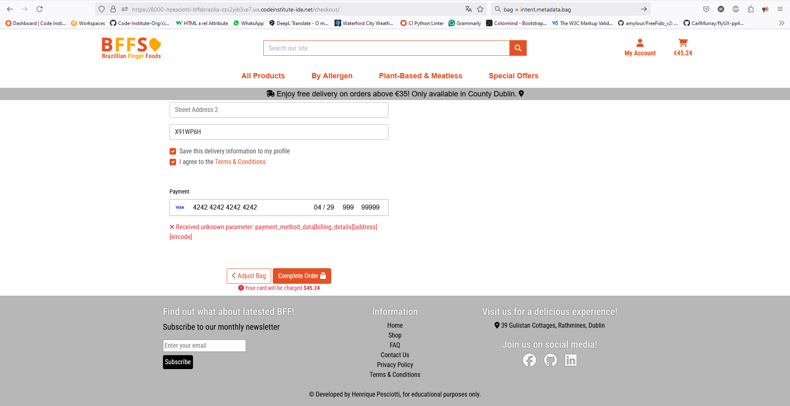

# BFFs | Brazilian Finger Foods


[Visit my website here](https://bffs-brazilian-finger-foods-99657e2a95f1.herokuapp.com/)

Return back to the [README.md](README.md) file.

## Testing - Table of Contents  

5. [Testing](#2-ux-design)

    5.1. [Validation](#51-validation)
      5.1.1. [Html Validation](#html-validation)
      5.1.2. [Performance Lighthouse](#performance-lighthouse)
         5.1.2.1. [Lighthouse Validator Desktop Pages](#lighthouse-validator-desktop-pages)
         5.1.2.2. [Lighthouse Validator Mobile Pages](#lighthouse-validator-mobile-pages)
      5.1.3. [Python PEP 8 Validation](#python-pep-8-validation)
         5.1.3.1. [Python PEP 8 Validator](#python-pep-8-validator)
      5.1.4. [CSS Validation](#css-validation)
    5.2. [Manual Testing](#52-manual-testing)
    5.3. [Bugs & Fixes](#53-bugs--fixes)
      5.3.1. [Bug 01](#bug-01)
      5.3.2. [Bug 02](#bug-02)
      5.3.3. [Bug 03](#bug-03)
      5.3.4. [Bug 04](#bug-04)
      5.3.5. [Bug 06](#bug-06)
      5.3.6. [Bug 07](#bug-07)
    5.4. [Unsolved Bugs](#54-unsolved-bugs)

### **5.1. Validation**

#### **Html Validation**

html validation was conducted through [HTML W3C Validator](https://validator.w3.org). 
The following images are validation screenshots taken from the service with the website Heroku live link. 
 - The validator could not test the pages that required logged in user (profile User Section) superuser credentials (Reports Section) and error pages (500, 403 and 404).
 - All the pages were valid

##### W3C Html Validator
| Page         | Status                 | Screenshot                                                |
|--------------|------------------------|-----------------------------------------------------------|
| Add Batches        | No errors or warnings   | <details><summary>Show Screenshot</summary>  </details> |
| Apply Discount     | No errors or warnings   | <details><summary>Show Screenshot</summary>  </details> |
| Bag     | No errors or warnings   | <details><summary>Show Screenshot</summary>  </details> |
| Checkout Success   | No errors or warnings   | <details><summary>Show Screenshot</summary>  </details> |
| Checkout       | No errors or warnings   | <details><summary>Show Screenshot</summary>  </details> |
| Delete Batch | No errors or warnings   | <details><summary>Show Screenshot</summary>  </details> |
| FAQs   | No errors or warnings   | <details><summary>Show Screenshot</summary>  </details> |
| Index        | No errors or warnings   | <details><summary>Show Screenshot</summary>  </details> |
| Log Out   | No errors or warnings   | <details><summary>Show Screenshot</summary>  </details> |
| Manage Batches   | No errors or warnings   | <details><summary>Show Screenshot</summary>  </details> |
| Product Details   | No errors or warnings   | <details><summary>Show Screenshot</summary>  </details> |
| All Products   | No errors or warnings   | <details><summary>Show Screenshot</summary>  </details> |
| My Profile   | No errors or warnings   | <details><summary>Show Screenshot</summary>  </details> |
| Shop Admin  | No errors or warnings   | <details><summary>Show Screenshot</summary>  </details> |
| Sign In  | No errors or warnings   | <details><summary>Show Screenshot</summary>  </details> |
| Sign Up  | No errors or warnings   | <details><summary>Show Screenshot</summary>  </details> |
| Update Price  | No errors or warnings   | <details><summary>Show Screenshot</summary>  </details> |


#### **Performance Lighthouse**

In general, Lighthouse evaluated a below-par performance across all website pages, even those comprised solely of static text. This could be attributed to my limited internet connection, which may have impacted the results. It is important to highlight that all images used in the web application were saved in the WebP format and compressed using [TinyPNG](https://tinypng.com/) to optimize them for better performance scores.

##### Lighthouse Validator
| Page                          | Screenshot                                                             |
|-------------------------------|-------------------------------------------------------------------------|
| Add a New Batch - Desktop     | <details><summary>Show Screenshot</summary>  </details> |
| Add a New Batch - Mobile      | <details><summary>Show Screenshot</summary>  </details> |
| Shop Admin - Mobile           | <details><summary>Show Screenshot</summary>  </details> |
| Shop Admin - Desktop          | <details><summary>Show Screenshot</summary>  </details> |
| Manage Batches - Desktop      | <details><summary>Show Screenshot</summary>  </details> |
| Manage Batches - Mobile       | <details><summary>Show Screenshot</summary>  </details> |
| Manage Products - Desktop     | <details><summary>Show Screenshot</summary>  </details> |
| Manage Products - Mobile      | <details><summary>Show Screenshot</summary>  </details> |
| Product Details - Desktop     | <details><summary>Show Screenshot</summary>  </details> |
| Product Details - Mobile      | <details><summary>Show Screenshot</summary>  </details> |
| All Products Pages - Desktop  | <details><summary>Show Screenshot</summary>  </details> |
| All Products Pages - Mobile   | <details><summary>Show Screenshot</summary>  </details> |
| Home - Desktop                | <details><summary>Show Screenshot</summary>  </details> |
| Home - Mobile                 | <details><summary>Show Screenshot</summary>  </details> |
| FAQs - Desktop                | <details><summary>Show Screenshot</summary>  </details> |
| FAQs - Mobile                 | <details><summary>Show Screenshot</summary>  </details> |
| Contact Us - Desktop          | <details><summary>Show Screenshot</summary>  </details> |
| Contact Us - Mobile           | <details><summary>Show Screenshot</summary>  </details> |
| My Profile - Desktop          | <details><summary>Show Screenshot</summary>  </details> |
| My Profile - Mobile           | <details><summary>Show Screenshot</summary>  </details> |
| Login - Desktop               | <details><summary>Show Screenshot</summary>  </details> |
| Login - Mobile                | <details><summary>Show Screenshot</summary>  </details> |
| Signin - Desktop              | <details><summary>Show Screenshot</summary>  </details> |
| Signin - Mobile               | <details><summary>Show Screenshot</summary>  </details> |
| Signout - Desktop             | <details><summary>Show Screenshot</summary>  </details> |
| Signout - Mobile              | <details><summary>Show Screenshot</summary>  </details> |


#### **Python PEP 8 Validation**

[Code Institute Python PEP 8 Linter](https://pep8ci.herokuapp.com/#) was used, no major error was detected, aside from indentation and whitespaces. After some refactoring the Python Linter didn't encoutered any errors. 

##### Python PEP 8 Validator
| App_File                  | Screenshot                                                       |
|---------------------------|------------------------------------------------------------------|
| bag_admin.py               | <details><summary>Show Screenshot</summary>  </details> |
| bag_apps.py                | <details><summary>Show Screenshot</summary>  </details> |
| bag_context.py             | <details><summary>Show Screenshot</summary>  </details> |
| bag_models.py              | <details><summary>Show Screenshot</summary>  </details> |
| bag_urls.py                | <details><summary>Show Screenshot</summary>  </details> |
| bag_views.py               | <details><summary>Show Screenshot</summary>  </details> |
| checkout_admin.py          | <details><summary>Show Screenshot</summary>  </details> |
| checkout_apps.py           | <details><summary>Show Screenshot</summary>  </details> |
| checkout_forms.py          | <details><summary>Show Screenshot</summary>  </details> |
| checkout_signals.py        | <details><summary>Show Screenshot</summary>  </details> |
| checkout_urls.py           | <details><summary>Show Screenshot</summary>  </details> |
| checkout_views.py          | <details><summary>Show Screenshot</summary>  </details> |
| checkout_webhook_handler.py| <details><summary>Show Screenshot</summary>  </details> |
| checkout_webhook.py        | <details><summary>Show Screenshot</summary>  </details> |
| faqs_admin.py              | <details><summary>Show Screenshot</summary>  </details> |
| faqs_apps.py               | <details><summary>Show Screenshot</summary>  </details> |
| faqs_models.py             | <details><summary>Show Screenshot</summary>  </details> |
| faqs_urls.py               | <details><summary>Show Screenshot</summary>  </details> |
| faqs_views.py              | <details><summary>Show Screenshot</summary>  </details> |
| home_admin.py              | <details><summary>Show Screenshot</summary>  </details> |
| home_apps.py               | <details><summary>Show Screenshot</summary>  </details> |
| home_models.py             | <details><summary>Show Screenshot</summary>  </details> |
| home_urls.py               | <details><summary>Show Screenshot</summary>  </details> |
| home_views.py              | <details><summary>Show Screenshot</summary>  </details> |
| products_admin.py          | <details><summary>Show Screenshot</summary>  </details> |
| products_apps.py           | <details><summary>Show Screenshot</summary>  </details> |
| products_models.py         | <details><summary>Show Screenshot</summary>  </details> |
| products_urls.py           | <details><summary>Show Screenshot</summary>  </details> |
| products_views.py          | <details><summary>Show Screenshot</summary>  </details> |
| profiles_admin.py          | <details><summary>Show Screenshot</summary>  </details> |
| profiles_apps.py           | <details><summary>Show Screenshot</summary>  </details> |
| profiles_forms.py          | <details><summary>Show Screenshot</summary>  </details> |
| profiles_models.py         | <details><summary>Show Screenshot</summary>  </details> |
| profiles_views.py          | <details><summary>Show Screenshot</summary>  </details> |
| shop_admin_admin.py        | <details><summary>Show Screenshot</summary>  </details> |
| shop_admin_apps.py         | <details><summary>Show Screenshot</summary>  </details> |
| shop_admin_forms.py        | <details><summary>Show Screenshot</summary>  </details> |
| shop_admin_models.py       | <details><summary>Show Screenshot</summary>  </details> |
| shop_admin_urls.py         | <details><summary>Show Screenshot</summary>  </details> |
| shop_admin_views.py        | <details><summary>Show Screenshot</summary>  </details> |


#### **CSS Validation** 

[W3C CSS Validator](https://jigsaw.w3.org/css-validator/) was used to validate custom CSS file. No errors or warnings were detected.

<details>
<summary>Base CSS</summary>


</details>

<details>
<summary>Checkout CSS</summary>


</details>

###  JavaScript Validation

### **5.2. Manual Testing**

Testing was conducted on desktop using Mozilla Firefox and Google Chrome browsers to ensure all forms accept the intended input and process it appropriately. 

Mobile testing focused on browsing, adding items to the bag, and completing checkout actions. The mobile devices used for testing included the following models:
- iPhone 12 Mini
- iPhone X
- iPhone 14

##### Manual Testing
| Feature                    | Tested?  | User Input Required                    | User Feedback Provided                                   | Pass/Fail | Fix             |
|----------------------------|----------|----------------------------------------|--------------------------------------------------------|-----------|-----------------|
| Navbar Logo and Icons      | Yes      | Click links bring user to correct destination | Text color change, icon animation, dropdowns          | Pass      | N/A             |
| Home Page                  | Yes      | Hover/click interactive features       | Carousel moves, Netflix-style row moves               | Pass      | N/A             |
| Search Home/All Products   | Yes      | Text input, click to search            | Load page results                                      | Pass      | N/A             |
| Register Page              | Yes      | Text input, click links                | Form works, toast message works                       | Pass      | N/A             |
| Email Validate             | Yes      | Click links                            | Button works, toast message works                     | Pass      | N/A             |
| Log In Page                | Yes      | Text input, click links                | Form fields work, toast message works                 | Pass      | N/A             |
| Log Out Page               | Yes      | Click links bring user to correct destination | Toast message works                                   | Pass      | N/A             |
| Contact Us                 | Yes      | Text input, click to save              | Pop-up modal, form field highlight, button animation   | Pass      | N/A             |
| Products                   | Yes      | Click product brings user to product detail page | Load product page                                      | Pass      | N/A             |
| Product Quantity           | Yes      | Click increment/decrement              | Product quantity successfully changed                 | Pass      | N/A             |
| Checkout                   | Yes      | Click "Secure Checkout", verify correct products in bag, enter delivery and payment details, submit form | Form field highlight, button animation, toast message, loading spinner during order processing, order saved to account, email sent | Pass | N/A |
| Shop Admin                 | Yes      | Click buttons bring user to correct URL | Button animation on hover                             | Pass      | N/A             |
| Manage Batches             | Yes      | Click buttons bring user to correct URL | Buttons for further actions work                      | Pass      | N/A             |
| Add a Batch                | Yes      | Click buttons bring user to correct URL with Edit/Add Batch Form | Buttons for further actions work                      | Pass      | N/A             |
| Add a Discount Btn (Manage Batches) | Yes | Click buttons bring user to correct URL | Buttons for further actions work                      | Pass      | N/A             |
| Delete Btn (Manage Batches)| Yes      | Click buttons bring user to correct URL | Buttons for further actions work                      | Pass      | N/A             |
| Edit Btn (Manage Batches)  | Yes      | Click buttons bring user to correct URL with Edit/Add Batch Form | Buttons for further actions work                      | Pass      | N/A             |
| Manage Products            | Yes      | Click buttons bring user to correct URL | Buttons for further actions work                      | Pass      | N/A             |
| Edit Price (Manage Products)| Yes     | Click buttons bring user to correct URL | Buttons for further actions work                      | Pass      | N/A             |
| Toggle Best-Seller (Manage Products)| Yes | Click buttons bring user to correct URL | Buttons for further actions work                      | Pass      | N/A             |
| Newsletter Sign Up         | Yes      | Text input, click to subscribe         | New tab subscription confirmation                     | Pass (If tried again, no message indicates prior subscription) | Permanent Bug |
| Footer                     | Yes      | Click links bring user to FAQ, social media, terms & conditions, contact us, and privacy policy | Font color change on hover                            | Pass      | N/A             |

 
### **5.3. Bugs & Fixes** 

##### **Bug 01**

Description: The edit_profile function returned a NameError "name for form is not defined". This must have happened due to a reference to an undefined variable pointed out to the form in the context. Through some code investigation, I detected that the function was not correctly accessing the instance of the Profile model associated with the logged-in user.

<details>
<summary>Bug 01</summary>


</details>

Solution: The solution involved verifying if the function utilized the appropriate instance of the user's profile. This was achieved by modifying the edit_profile function to correctly reference the logged-in user's profile through the correct query set, allowing for the data to be retrieved.

##### **Bug 02**

Description: The browser encountered a NoReverseMatch error when attempting to use the reverse function for the profile URL in Django. This error must have happened because the URL pattern did not match the parameters being passed to the reverse function. 

<details>
<summary>Bug 02</summary>


</details>

Resolution: I investigated some former students' git hub repos, and I came to the conclusion that this error was somehow connected to the problem of the user being created by Django All Auth and not being connected later to the Profile database. So, based on Amy Richards's repo, I implemented signals in profile models to ensure that the created users and the future users would have the profile created simultaneously as the user was created. Here is the snippet that I used:

```python
@receiver(post_save, sender=User)
def create_user_profile(sender, instance, created, **kwargs):
    """
    Creates a profile for a new user.
    """
    if created:
        Profile.objects.create(user=instance)

@receiver(post_save, sender=User)
def save_user_profile(sender, instance, **kwargs):
    """
    Creates a profile for a user created before profile app.
    """
    if hasattr(instance, 'profile'):
        instance.profile.save()

```

##### **Bug 03**

Description: A layout related bug. For unknown reasons, at that time, I could not apply paddings to profile form labels. 

<details>
<summary>Bug 03</summary>


</details>

Description: A layout related bug. For unknown reasons, at that time, I could not apply paddings to profile form labels.
Solution: I found a thread in stack overflow indicating a solution to the matter. This bug happens because a label is an inline element, and so is not affected by the top and bottom padding. The solution was to transform the labels into block-level elements, thus allowing the padding to have an effect.


##### **Bug 04**

Description: During the customization of the signup form, due to the necessity of making it necessary for the user to provide a valid e-mail address for contact in the profile page, the custom html would return a None placeholder text in the user name's input area. 

<details>
<summary>Bug 04</summary>


</details>

Solution: I thought it was a placeholder mistake, but the placeholder name was an indication username. During a call with my mentor, he pointed out that none was returned from value={{ form.username.value }}. This template variable was not important to the signup page, so I ended up removing it.

<details>
<summary>Bug 04 - Solution</summary>


</details>

##### **Bug 05**

Description:  I added a modal to confirm deletion actions, but in the mobile versions of website the modal would not appear with the fading effect occupying the entire screen and/or the buttons would not work. 

<details>
<summary>Bug 05</summary>


</details>

Solution: Through some code investigation, I concluded that the bug happened in mobile versions because it was connected to the card representation on small screens, which would override the tables on bigger screens. This function consists of a for loop that returns template variables to populate the cave information shown on the screen. The lock of the screen or the freezing fading effect and absence of the modal box happens because the modal if statement was inserted inside the indentation for the loop card. I adjusted the indentation, and the page and modals worked as expected.

##### **Bug 06**

Description: When editing a registered cave it would ask for the user to provide a user, which is an occult field, because this field should not be altered or even filled during cave add; the filling of the field is automatic. I tried to set the user field to not required, and the cave record would return without a user/author. This was unexpected because the edit_caver function would save the user during the editing process (cave.user = user.username), but this did not prevent the empty user outcome. The following screenshot was taken during the debugging section, and the user field was made visible. 

<details>
<summary>Bug 06</summary>


</details>

Solution: I refactored the edit_cave function to maintain the user as not required, capture the cave user from the cave model, and pass it through a variable user, which was attributed to the cave.user after the validation of the form. This adjustment corrected the issue.

##### **Bug 07**

Description: The notification modal was displaying empty when refresh or redirect requests were made.

<details>
<summary>Bug 07</summary>



</details>

Solution: I detected this bug during testing, and corrected it by inserting a none to the style attribute of the modal. I implemented this by an If statement, if there was no messages mode display is none.


### **5.4. Unsolved Bugs** 

Through my testing, I have not detected critical bugs, but there are three minor issues left unsolved.
They are not bugs per se because they would not hinder the usage of the website.
Two of them are more layout inconsistencies, and the last one is an error message trailing div from the w3c validator.

Unresolved Bug 01 - layout inconsistency on the button to upload button of the cav_map. My system is in pot-br, so the default is displayed in Portuguese, but this will change according to the system's main language. The problem is that the box doesn't follow the theme design of the website. To fix this inconsistency, I would have to customise all the add_cave forms, but all my validation done in the model would have to be inserted again, demanding more time, which I was short. So, I opted not to solve this issue.

<details>
<summary>Bug 01</summary>


</details>

The second layout inconsistency has to do with the whitespaces displayed in front of the bio text during the editing of a profile.
I looked at it, but I could not find a quick fix. To reach MVP and implement other features, I judged this would not be fixed at this time.


<details>
<summary>Bug 02</summary>


</details>


The validator w3c html validator pointed out that there was a stray div tag on the page.
I double-checked my code, and there was no indentation problem; there was no layout change as I intended and no loss to the navigability. I suppose this issue concerns the Django's rendering of the page.

<details>
<summary>Bug 03</summary>


</details>